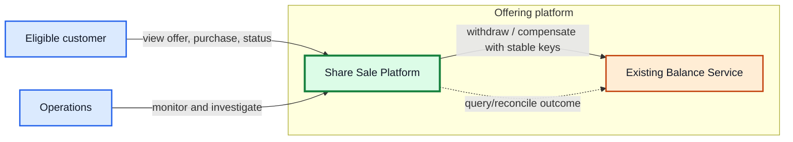
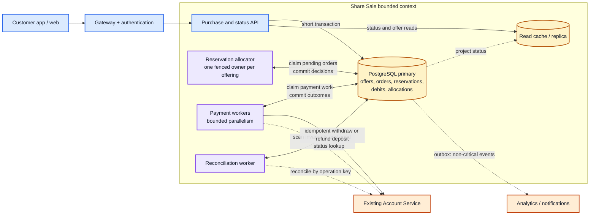
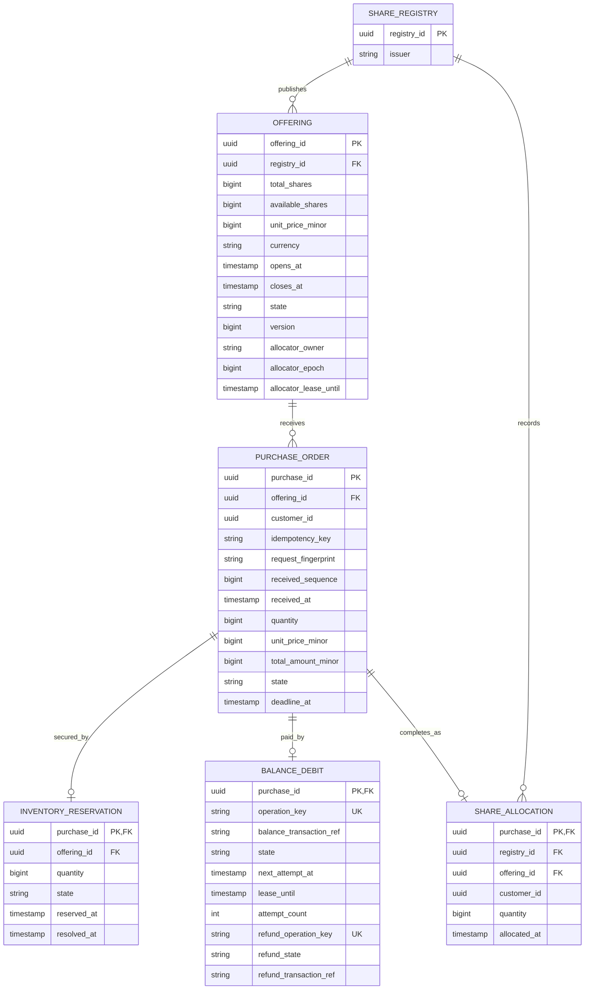
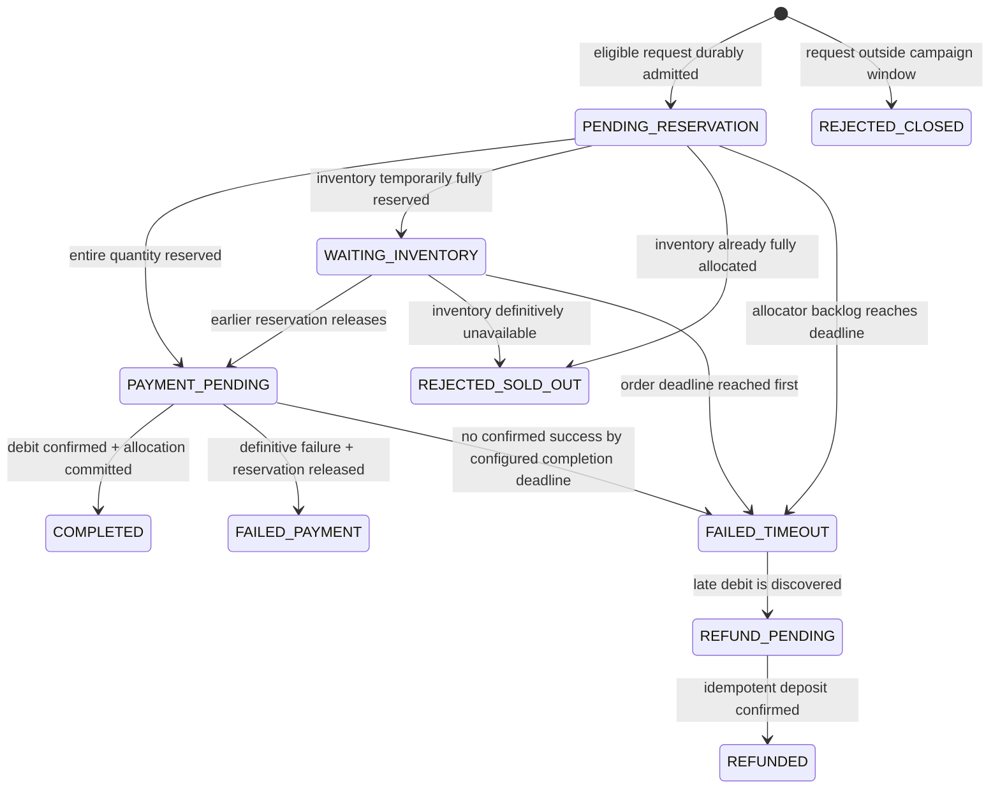
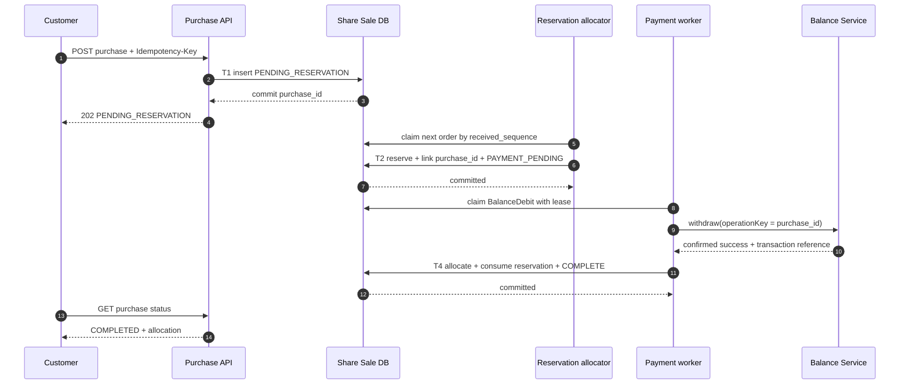

# Fixed-price share offering

**Scope:** a reusable system-design rehearsal for finite inventory, asynchronous payment, and ownership allocation.

**Public-source boundary:** the scenario is inspired by an [anonymous public candidate report](https://www.reddit.com/r/cscareerquestionsuk/comments/1u3bka8/wise_seniori3_pair_programming_round/) and an [official backend system-design guide](https://wise.jobs/backend-system-design-interviews). It is a generic practice exercise, not a recovered or guaranteed prompt and not a description of any company's private architecture.

The architecture below follows from the stated product contract and correctness invariants.

---

## 1. The answer in one minute

> “I would build one Share Sale bounded context with one authoritative relational database. The API durably records an idempotent purchase request and returns `PENDING_RESERVATION` quickly. A fenced reservation allocator processes requests in durable receipt order and atomically decrements available inventory while creating an order-linked reservation. If inventory is temporarily held by unpaid earlier orders, it parks the queue until stock is released or definitively consumed. Payment workers withdraw from an existing Account Service using `purchase_id` as the stable operation key. A confirmed debit is atomically converted into an immutable share allocation; a definitive payment failure releases the reservation. All local state transitions are transactional and every remote effect is idempotent and reconciled. I would begin with the database as the durable workflow queue, measure allocator throughput and lock latency, and add a broker only if the measured backlog threatens the completion objective.”

The essential flow is:

```text
durable order -> inventory reservation -> balance debit -> ownership allocation
```

Each arrow is recoverable. No queue, retry or timeout is allowed to create a second reservation, debit or allocation.

---

## 2. Practice problem statement

An issuer offers a finite quantity of company shares to eligible customers at a fixed price.

- The campaign has a fixed opening and cutoff time.
- Customers buy whole shares; there is no market price or order book.
- Customers pay from money already held in their accounts.
- An existing internal Balance Service exposes balance, deposit and withdrawal capabilities.
- The issuer must record which customers own the allocated shares.
- The rehearsal supplies an expected and peak request rate before capacity planning.

Assumptions for this rehearsal:

- buy only; no resale;
- all-or-nothing orders; no partial fill;
- one customer may place several distinct orders;
- safe client retries are required;
- requests durably admitted before the cutoff remain eligible for later processing;
- approximate first-received-first-processed is sufficient; no global ordering guarantee for simultaneous requests;
- acknowledge a received request within the acknowledgement SLO;
- target a final result within the configured completion deadline;
- design the platform so a future offering can reuse it.

### Explicit assumptions to state

1. Upstream authentication supplies a trusted `customer_id`; identity implementation is outside this exercise.
2. Quantity is a positive whole number and an order is accepted completely or rejected completely.
3. The Balance Service must support idempotent operation references and outcome lookup for both withdrawal and compensating deposit. Without them, a lost response cannot be distinguished from a lost money movement.
4. Brokerage, external settlement and secondary-market trading are outside scope.
5. The primary write path has one active region for an offering. Reads may be served globally.
6. Product defines a per-customer purchase cap and maximum concurrent unpaid orders. Without that control, one customer could temporarily reserve a disproportionate share of the offer even though the inventory accounting remains correct.

---

## 3. Product contract before technology

### APIs

```http
GET /offerings/{offeringId}
```

Returns the fixed price, campaign window, status and an **approximate** remaining quantity. The displayed quantity is not used to make reservation decisions.

```http
POST /offerings/{offeringId}/purchases
Idempotency-Key: <customer-generated-key>

{ "quantity": 25 }

202 Accepted
{
  "purchaseId": "p-123",
  "status": "PENDING_RESERVATION"
}
```

`202` means the request is durably recorded. It does not promise inventory or payment success.

```http
GET /purchases/{purchaseId}
```

Returns the current customer-visible state and, when terminal, the allocation or rejection reason.

### Idempotency contract

- Unique key: `(customer_id, offering_id, idempotency_key)`.
- Persist a request fingerprint containing offering and quantity.
- Same key and same fingerprint returns the original purchase.
- Same key with different input returns `409 Conflict`.
- A customer making a genuinely new purchase uses a new key.
- After admission, `purchase_id` becomes the business idempotency key for reservation, debit and allocation.

### Cutoff contract

The authoritative eligibility time is a trusted server/database timestamp persisted with the order. Client clocks and later worker-processing time are irrelevant.

```text
opens_at <= received_at < closes_at
```

An eligible request may finish after `closes_at`. A request durably admitted at or after `closes_at` is rejected.

Offering lifecycle is deliberately two-phase: `OPEN -> CLOSED_FOR_NEW_ORDERS -> SETTLED`. Closing stops admission; it does not invalidate pre-cutoff pending orders. `SETTLED` is reached only after admitted orders, active reservations and refund obligations are resolved. Temporary full reservation is not final sold-out: pre-cutoff orders may wait for a failed payment to release inventory until their deadline.

---

## 4. Capacity: calculate before choosing infrastructure

Let `U` be active customers during a peak window of `T` seconds and let `O` be mean orders per customer:

```text
average requests/second = U * O / T
```

State `U`, `O`, `T`, the expected burst multiplier, and the Account Service latency before choosing capacities. Test a sustained multiple of the expected average and a larger short burst, then replace assumptions with production traffic histograms. The difficult dimension is usually not row storage; it is many requests competing for one finite stock count.

### Workload separation

- **Admission:** horizontally scalable inserts; must meet the product-defined acknowledgement SLO.
- **Reservation:** logically serialized for one offering; must not oversell.
- **Payment:** highly parallel but limited by Balance Service latency and rate limits.
- **Status reads:** cacheable/eventually consistent.
- **Analytics:** asynchronous and outside the purchase correctness path.

Use Little's Law for the payment pool: required in-flight calls are approximately `requests/second × mean latency`. Add headroom for the target utilisation and partner variance. The real limits come from measured latency and the Account Service's agreed capacity.

---

## 5. System context



The Share Sale Platform owns orders, inventory reservations and share allocations. Balance Service owns customer money. Neither duplicates the other's ledger.

---

## 6. Container architecture

Start with one bounded context and one database. Separate runtime processes are deployment choices, not separate sources of truth.



### Availability without double allocation

- Run the stateless API and workers across availability zones.
- Use a multi-zone PostgreSQL primary with synchronous standby and automated failover; acknowledge admission only after the durable commit.
- Keep one active write region for an offering. After failover, allocator ownership must be reacquired with a higher epoch before reservations resume.
- Status reads may use a replica/cache, but reservation and terminal payment decisions always use the primary.
- If Balance Service is impaired, retain admitted work only while measured recovery capacity can still satisfy the configured completion objective. Once it cannot, pause new purchase admission rather than create a backlog the product promise cannot honour.

### Why there is no separate Order Service and Order Executor service

The API and workers need different scaling profiles, but they operate one purchase lifecycle and require one atomic write boundary. They can run as separate processes while sharing:

- one bounded context;
- one schema and transaction model;
- one authoritative state machine;
- no REST/event synchronisation between competing databases.

The database rows themselves are durable work. A broker is not required for the first correct design. If the organisation's platform standard requires a broker, publish from a transactional outbox; do not introduce a best-effort commit-then-publish gap.

---

## 7. Domain model

### Ubiquitous language

- **Offering:** a fixed-price, time-bounded campaign with finite inventory.
- **PurchaseOrder:** one customer's all-or-nothing request.
- **InventoryReservation:** proof that a specific purchase consumed a specific quantity of offer inventory temporarily.
- **BalanceDebit:** our evidence and operation identity for the Balance Service withdrawal.
- **ShareAllocation:** immutable proof that a completed purchase granted ownership.
- **ShareRegistry:** issuer-level collection of ownership allocations. A current holding is a projection of allocations, not a second write-side truth.

### Minimal ERD



`purchase_id` is deliberately the identity of the reservation, debit operation and allocation. A retry finds the existing business effect instead of generating another one. The idempotency constraint is composite: `UNIQUE(customer_id, offering_id, idempotency_key)`.

Work indexes are deliberately aligned to the workflow: `(state, received_sequence)` for reservation admission, `(state, next_attempt_at)` for debit retries, and a partial `InventoryReservation(offering_id) WHERE state = 'ACTIVE'` index for the near-sell-out test. `InventoryReservation.purchase_id`, `BalanceDebit.operation_key` and `ShareAllocation.purchase_id` are unique database guards, not application conventions.

### Hard invariants

1. `available_shares + SUM(active reservations) + SUM(allocations) = total_shares`.
2. Available inventory and every reservation/allocation quantity are non-negative.
3. Quantity is a positive integer; `total_amount_minor = quantity * 1_000` for £10.00.
4. One client idempotency key maps to one purchase and one request fingerprint.
5. One purchase creates at most one reservation, one successful debit and one allocation.
6. A reservation quantity equals its order quantity; there are no partial fills.
7. Balance debit is attempted only after an active reservation exists.
8. `COMPLETED` implies a confirmed debit and an immutable allocation.
9. Allocation-terminal states do not regress because of duplicate or late messages; a late debit for a timed-out order creates a refund obligation, not an allocation.

---

## 8. Customer-visible state machine



An uncertain Balance response remains internally retryable while the customer still sees `PAYMENT_PENDING`. At the configured completion deadline, a payment-stage order becomes allocation-terminal `FAILED_TIMEOUT` and its reservation is released. An order that never reached reservation also receives a terminal result without changing inventory. A later debit can never revive the allocation; it creates a refund obligation. Internal lease and retry states do not need to leak into the customer model.

---

## 9. Exact transaction boundaries

### T1 — durably admit the request

One short API database transaction:

1. Read the offering's price and window using trusted database time.
2. If the request is outside the window, persist/return the idempotent `REJECTED_CLOSED` result. Otherwise insert `PurchaseOrder(PENDING_RESERVATION)` with immutable quantity and price snapshot.
3. Enforce the client idempotency constraint and fingerprint.
4. Assign `received_at`, `received_sequence` and `deadline_at`.
5. Commit. Return `202 PENDING_RESERVATION` for an eligible order, or the terminal `REJECTED_CLOSED` result for an ineligible one.

Crash result:

- before commit: no order; the client retries safely;
- after commit but before response: the retry finds and returns the same order.

No inventory or Balance Service call is performed on this request thread.

### T2 — reserve or reject inventory

A single fenced allocator owns the active offering. Lease acquisition uses database time and a compare-and-set on `allocator_owner` and `allocator_lease_until`; each new owner increments and receives `allocator_epoch`. Every reservation transaction verifies owner, epoch and expiry, so a paused old process cannot resume as a second writer. It processes the head eligible order by `(received_sequence, purchase_id)`. The sequence gives deterministic durable receipt priority, while making no claim about the ordering of truly simultaneous requests arriving at different API nodes.

Concretely, acquisition updates the owner, increments the epoch and sets a short expiry only when the existing lease is expired; renewal updates the expiry only when both owner and epoch still match. Both use database time. A failed compare-and-set means the process is no longer allocator and must stop.

For one order, one local transaction:

```sql
BEGIN;

SELECT offering_id, state, quantity, deadline_at
FROM purchase_order
WHERE purchase_id = :purchase_id
FOR UPDATE;

-- Continue only for PENDING_RESERVATION or WAITING_INVENTORY. Use values
-- from this locked row, never duplicated event parameters. If database time
-- has reached deadline_at, make the order terminal without touching inventory.

SELECT allocator_owner, allocator_epoch, allocator_lease_until
FROM offering
WHERE offering_id = :locked_offering_id
FOR UPDATE;

-- Abort when owner/epoch differs from this worker or the lease has expired.

UPDATE offering
SET available_shares = available_shares - :quantity,
    version = version + 1
WHERE offering_id = :locked_offering_id
  AND allocator_epoch = :worker_epoch
  AND allocator_owner = :worker_id
  AND allocator_lease_until > clock_timestamp()
  AND available_shares >= :quantity;

-- If one row changed:
--   INSERT inventory_reservation(purchase_id, offering_id, quantity, 'ACTIVE')
--   INSERT balance_debit(purchase_id, operation_key, 'PENDING')
--   UPDATE purchase_order SET state = 'PAYMENT_PENDING'
-- If zero rows changed because owner/epoch/lease no longer matches: ROLLBACK.
-- Otherwise availability was insufficient:
--   If any ACTIVE reservation could still release inventory:
--     UPDATE purchase_order SET state = 'WAITING_INVENTORY'
--   Else:
--     UPDATE purchase_order SET state = 'REJECTED_SOLD_OUT'

COMMIT;
```

The unique `inventory_reservation.purchase_id` is the explicit link missing from a counter-only design. It proves exactly which order changed the offer inventory.

If the head order does not fit while any active payment reservation exists, it becomes `WAITING_INVENTORY` and the allocator parks the offering instead of spinning or letting later requests bypass it. A release may make the head order fit. When no active reservation remains and the available quantity is still insufficient, the head order is definitively `REJECTED_SOLD_OUT`, and processing advances to the next order. The partial active-reservation index makes that existence test cheap; no aggregate over millions of rows is needed.

Waiting orders are not continuously rescanned. A release increments `Offering.version` and wakes the allocator; periodic version polling recovers a missed wake-up. A lightweight finalizer also checks the partial active-reservation index. When the final active reservation is consumed and no further stock can return, it wakes the allocator to reject an unfillable head order and continue. Database state is authoritative—the wake-ups are only latency optimisations.

This is an explicit fairness choice: bounded FIFO may leave some available shares idle behind a larger earlier order until a reservation resolves, but the per-order cap and configured completion deadline bound that effect. If the product instead values maximum sell-through over receipt priority, the allocator can select later orders that fit; that is a product-policy change with starvation rules, not a reason to change the correctness model.

Crash result:

- before commit: no reservation; the order remains pending;
- after commit: available inventory, reservation, debit work and order state all agree;
- repeated processing: the locked order is no longer pending and the unique reservation prevents a second decrement.

### T3 — call the Balance Service

Payment workers claim `BalanceDebit(PENDING)` rows with a short lease, commit the claim, and call Balance Service outside any database transaction. Before starting a new withdrawal attempt, the worker verifies that the order is still `PAYMENT_PENDING` and that database time plus the configured Balance-call timeout is before `deadline_at`. If too little budget remains, it runs T6 instead of creating a withdrawal likely to require compensation. After an ambiguous earlier attempt, it may query status beyond that point, but must not initiate a new withdrawal effect after the deadline budget is exhausted.

Do not perform a separate balance lookup as the authority. It creates a time-of-check/time-of-use race. The atomic Balance Service withdrawal decides whether funds are available.

A balance lookup may still be used as a cheap screening optimisation, but never as proof of payment. Per-customer caps, a limit on concurrent unpaid reservations and rate limits are the real protections against repeatedly tying up inventory with unfunded orders.

```text
withdraw(
  customerId,
  amount = quantity * £10,
  operationKey = purchaseId
)
```

Required remote contract:

- retrying the same `operationKey` returns the original effect/outcome; or
- the outcome can be queried by `operationKey`.

A timeout means **unknown**, not failed.

### T4 — payment success and ownership allocation

After a definitive debit success, one local transaction:

1. Lock the order, reservation and debit rows in that order.
2. Proceed with allocation only when the order is `PAYMENT_PENDING`, the reservation is `ACTIVE`, and database time is still before `deadline_at`.
3. Mark `BalanceDebit` successful with the Balance transaction reference.
4. Insert `ShareAllocation`, unique by `purchase_id`.
5. Compare-and-set the reservation `ACTIVE -> CONSUMED`; require exactly one changed row.
6. As the final state-changing statement, compare-and-set the order `PAYMENT_PENDING -> COMPLETED` with `deadline_at > clock_timestamp()`; require exactly one changed row.
7. Commit. A duplicate success for an already completed order is a no-op.

If the order is already `FAILED_TIMEOUT`, its reservation is `RELEASED`, or the deadline predicate fails, do **not** allocate shares. Roll back the allocation path, record the late debit and create the idempotent refund obligation `refund:<purchase_id>` instead. A delayed deadline scanner therefore cannot allow a post-deadline success handler to win merely by locking first.

If the worker crashes after the remote debit but before T4, its lease expires. The next worker queries/retries using the same `purchase_id`, obtains the original success and safely runs T4.

### T5 — definitive payment failure

One local transaction:

1. Lock the order, reservation, debit and offering rows in that order.
2. Continue only when the order is `PAYMENT_PENDING` and the reservation is `ACTIVE`.
3. Compare-and-set the reservation `ACTIVE -> RELEASED`; require exactly one changed row.
4. Increment `Offering.available_shares` by the locked reservation quantity and increment `Offering.version` in the same update.
5. Compare-and-set the order `PAYMENT_PENDING -> FAILED_PAYMENT`.
6. Mark `BalanceDebit` definitively failed and commit.

A duplicate failure sees a non-active reservation and performs no inventory increment.

Released shares can satisfy any purchase durably admitted before the cutoff, even after the offering is closed to new requests. The offering is not finally `SETTLED` until admitted work and payment compensation have finished.

### T6 — the configured completion deadline and late debit

A deadline worker scans indexed, non-terminal orders whose `deadline_at` has passed and locks each order before deciding which path applies:

1. `PENDING_RESERVATION -> FAILED_TIMEOUT`: allocator backlog missed the response contract; no inventory row exists, so inventory is untouched.
2. `WAITING_INVENTORY -> FAILED_TIMEOUT`: the order never acquired inventory before its deadline; inventory is untouched.
3. For `PAYMENT_PENDING`, use the T5 lock order and compare-and-set reservation `ACTIVE -> RELEASED`; only the transaction that changes one reservation row increments `Offering.available_shares` and `Offering.version`, then changes the order to `FAILED_TIMEOUT`.
4. Mark an existing debit operation timed out, while continuing outcome reconciliation by `purchase_id`.

If a later lookup proves that the original withdrawal succeeded, the payment handler must not run T4. It changes the order `FAILED_TIMEOUT -> REFUND_PENDING` and deposits the amount using `refund:<purchase_id>` as the idempotency key. A timeout on that deposit is also treated as unknown: query or retry the same refund key. Confirmed deposit moves the order to `REFUNDED` and stores the refund transaction reference.

The race between success and timeout is safe because both paths first lock the same order and reservation, and T4 also enforces the database-time deadline predicate. Before the deadline a confirmed success may allocate; after it, T4 cannot complete even if the deadline scanner is late, so the only valid outcome for a discovered debit is refund.

All multi-row transitions use the same lock order: purchase order, reservation, debit when present, then offering when inventory changes. `READ COMMITTED` is sufficient because correctness comes from explicit row locks, conditional state transitions and unique constraints; a broader repeatable-read transaction would not improve the remote-call boundary.

---

## 10. Happy-path sequence



---

## 11. Concurrency and the hot offering

### Why not application-level optimistic locking first

The classic pattern is:

```text
SELECT available, version
UPDATE ... WHERE version = oldVersion
retry on conflict
```

That is a poor default for a deliberately hot row. Many workers read the same version; one succeeds and the others discard work and retry. Under load, retries amplify the load causing the conflict.

In this design:

- one logical allocator makes reservation decisions for an offering;
- the database conditional update remains the final no-oversell guard;
- `version` is a monotonic inventory-change token and can be included in emitted audit events, but it is not the primary contention strategy or an audit log by itself;
- failover is protected by a lease/epoch, while the order-state lock and unique reservation remain final safety guards.

### Throughput is still measured

One logical writer is not magic. Its measured decision rate must exceed arrivals:

```text
projected reservation delay = pending reservation count / measured decisions per second
```

Alert before the projected delay threatens the configured completion completion objective.

Load-test:

- allocator decisions/second;
- oldest pending-order age;
- row-lock and commit p50/p95/p99;
- reservation rejection rate near sell-out;
- payment-worker queue age;
- Balance Service latency and rate-limit responses.

### If one transaction per order is too slow

Use a small persistence microbatch, not a configured completion business clearing batch:

1. Under the current allocator epoch, claim a bounded ordered slice with `FOR UPDATE SKIP LOCKED`, for example up to 100 pending/waiting orders or 20 ms of arrivals.
2. Re-check that every claimed order remains `PENDING_RESERVATION` or `WAITING_INVENTORY`, has not reached its deadline, and lock orders in deterministic sequence.
3. Lock the offering after the order rows, matching the global lock order used by failure/deadline transitions.
4. Decide orders sequentially against a local remaining count; stop the slice at the first temporarily unfillable order so later orders do not bypass it.
5. Bulk-insert individual reservations keyed by `purchase_id`, create debit work and update individual order results.
6. Decrement `available_shares` once for the accepted total and commit.

Every order still has an individual decision and `purchase_id`. The small batch only amortises database commits.

### When to introduce a broker

If database polling or admission spikes become a measured bottleneck:

- write the order and outbox atomically;
- publish committed reservation requests through CDC;
- key by `offering_id`;
- keep one fenced logical allocator per offering;
- make reservation decisions idempotent by `purchase_id`.

The broker absorbs load and improves delivery operations; it does not replace the local reservation transaction.

### Why inventory buckets are the last option

Buckets parallelise writes but introduce:

- stranded inventory when a request is larger than one bucket's remainder;
- spillover traffic and new hotspots near sell-out;
- quota transfer and recovery rules;
- less defensible first-received ordering;
- a second mechanism required to decide global sold-out state.

Use buckets only after measurement proves both the single allocator and bounded microbatch cannot meet the SLO and the product accepts the allocation semantics.

---

## 12. Payment deadline and ambiguous outcomes

The agreed customer contract is a final allocation outcome within the configured completion deadline. For a payment-stage order, T6 marks an unconfirmed order `FAILED_TIMEOUT` and releases its reservation at the deadline. Orders that never reserved inventory also time out, but do not mutate inventory.

A timeout still does not prove that money never moved. The Balance operation remains reconciled by the same `purchase_id`. If a late debit is discovered:

- never allocate shares after `FAILED_TIMEOUT` because they may already have been reassigned;
- create an idempotent refund obligation `refund:<purchase_id>`;
- show `REFUND_PENDING` until the compensating deposit succeeds;
- finish in `REFUNDED`, retaining both Balance transaction references for audit.

This satisfies the configured completion allocation contract without pretending that a network timeout can make an ambiguous financial effect disappear.

---

## 13. Failure matrix

| Failure | Safe recovery |
|---|---|
| Client repeats the POST | Unique idempotency key returns the original purchase. |
| Same key, different quantity | Reject `409`; never reinterpret the existing order. |
| API crashes before T1 commit | Nothing durable happened; retry is safe. |
| API commits but loses the HTTP response | Retry returns the persisted `PENDING_RESERVATION` order. |
| Allocator crashes before T2 commit | Entire transaction rolls back; order remains pending. |
| Allocator crashes after T2 commit | Order, reservation and available inventory already agree; processing continues with payment. |
| Reservation work is repeated | Order-state guard plus unique reservation means no second decrement. |
| Inventory is temporarily exhausted by unpaid reservations | Keep an eligible order in `WAITING_INVENTORY`; retry it when an exact linked reservation releases. |
| A waiting order reaches its deadline | Mark it `FAILED_TIMEOUT`; it never owned inventory, so no counter changes. |
| Allocator backlog reaches an order's deadline | Mark the still-pending order `FAILED_TIMEOUT`; it never owned inventory, so no counter changes. |
| Too little deadline budget remains for a new withdrawal | Do not start another withdrawal; run T6 and only reconcile any already-attempted operation. |
| Balance call times out before deadline | Keep customer state `PAYMENT_PENDING`; query or retry the same operation key. |
| Debit succeeds but worker crashes before T4 | Same-key result lookup recovers success; T4 is idempotent. |
| Debit result is handled after the order deadline | T4's deadline predicate forbids allocation; create the idempotent refund obligation. |
| Payment failure is definitive | T5 releases the exact linked reservation. |
| No confirmed debit by the configured completion deadline | T6 compare-and-sets the active reservation to released, increments availability/version once and marks `FAILED_TIMEOUT`. |
| Debit is discovered after timeout release | Never allocate; create `refund:<purchase_id>` and progress to `REFUNDED`. |
| Allocation processing is repeated | Unique `ShareAllocation.purchase_id` returns the existing allocation. |
| Worker dies while holding work | Short lease expires; another worker retries using the same business key. |
| One customer floods unfunded orders | Enforce eligibility, a purchase cap, a concurrent-unpaid-order limit and customer/device rate limits before reservation. |
| Primary region fails | Promote one fenced writer; never let two regions allocate the same offering concurrently. |
| Analytics or notification fails | No effect on inventory, payment or ownership. |

---

## 14. Reconciliation and observability

### Continuous correctness checks

```text
Offering.available_shares
  + SUM(active InventoryReservation.quantity)
  + SUM(ShareAllocation.quantity)
  = Offering.total_shares

For every COMPLETED order:
  BalanceDebit = SUCCEEDED
  InventoryReservation = CONSUMED
  exactly one ShareAllocation exists
```

### Service-level indicators

- admission p99 latency and error rate;
- oldest `PENDING_RESERVATION` age;
- reservation decisions/second and projected backlog delay;
- payment completion p50/p95/p99;
- aged `PAYMENT_PENDING`, `REFUND_PENDING` and expired-lease counts;
- Balance Service timeout, rate-limit and retry rates;
- reconciliation mismatch count and oldest unresolved mismatch;
- database lock-wait and transaction-commit latency.

### Business and risk metrics

- sell-through percentage and amount raised;
- completed sales and amount raised per day;
- unique purchasers and completed purchases;
- purchase and completion breakdown by customer region and funding currency;
- payment success/failure rate;
- zero oversold shares;
- zero duplicate debits;
- zero duplicate allocations;
- rejected bot/rate-limit activity and concentration by customer/device;
- support contacts per thousand purchases.

---

## 15. What to draw and say in a 45-minute interview

The deck is deliberately exhaustive; the spoken answer should not be. Establish the invariant and core path first. Lease mechanics, the detailed waitlist, microbatching, broker escalation, buckets and late-refund internals are drill-down material only when the interviewer asks.

| Time | What to produce |
|---|---|
| 0–5 min | Restate the fixed-price sale and clarify whole shares, payment contract, cutoff and result semantics. |
| 5–8 min | Calculate the supplied peak rate and state burst assumptions. |
| 8–12 min | State the hard invariants and `202 PENDING_RESERVATION` contract. |
| 12–17 min | Draw the system context and the single bounded-context container diagram. |
| 17–22 min | Draw the domain ERD and explain why reservation, debit and allocation are linked by `purchase_id`. |
| 22–30 min | Walk the core path: T1 admission, T2 atomic reservation, T3 idempotent debit, T4 allocation or T5 release. |
| 30–35 min | Proactively handle two crashes: after reservation and after a successful remote debit. Mention the deadline/refund rule in one sentence. |
| 35–40 min | Explain the hot-row decision: one logical allocator, database guard, measured throughput; stop unless asked to scale further. |
| 40–45 min | Reconciliation, operational metrics, questions and concise trade-off summary. |

### Spoken transaction summary

> “My first local transaction only admits an idempotent order, so I can acknowledge within the product SLO. My second local transaction is the finite-inventory decision: it locks the pending order, conditionally decrements available quantity, inserts a reservation whose primary key is the purchase ID, creates the debit work and moves the order to payment pending. Therefore a crash leaves either all of that or none of it. I call Account Service outside the transaction with purchase ID as the remote operation key. While deadline budget remains, I query or retry that same key; I never invent a second debit. On success, one local transaction records the debit, consumes the reservation, creates the immutable ownership record and completes the order. At the configured deadline unresolved work fails; only a payment-stage order releases a reservation, and any late debit is refunded rather than allocated.”

### Spoken scale summary

> “I size from the supplied traffic rather than inventing a much larger problem. The finite inventory is the serialized invariant. One fenced allocator avoids optimistic retry storms and processes the durable receipt sequence without claiming a perfect global order for simultaneous requests. I measure its service rate and backlog age. If one commit per order is insufficient, I amortise persistence over small ordered chunks while retaining individual order decisions. I add a broker or inventory buckets only after measurement shows the simpler boundary cannot meet the completion objective.”

---

## 16. Design review checklist

The design should pass these general correctness checks:

1. **Finding failures without hints:** T1–T6 make the crash boundaries explicit before the interviewer asks. The design proactively covers reservation commit, lost payment response, deadline races, refund compensation and allocation retry.
2. **Order-to-inventory link:** `InventoryReservation.purchase_id` is a unique business record committed atomically with the counter movement and order state.
3. **Optimistic-lock explanation:** the design does not claim bucketing makes conflicts rare. It explains why read-version-retry is weak for a hot counter, retains a conditional database guard and measures throughput.
4. **Unnecessary service split:** API, allocator and payment workers scale separately but remain one bounded context with one authoritative database.

The lesson is not “always use one service” or “never use optimistic locking.” It is:

> Choose the smallest consistency boundary that can enforce the business invariants, then introduce distribution only where a measured constraint justifies it.
