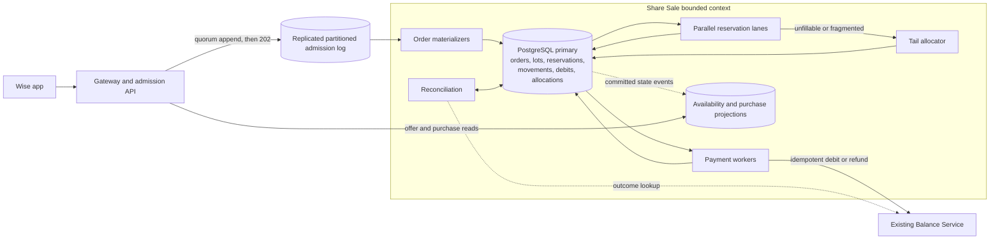
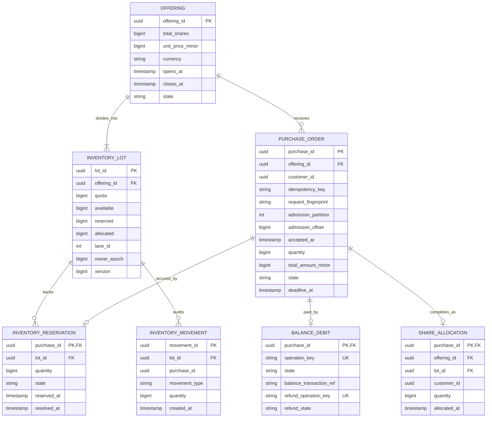

# Wise system design — burst-safe fixed-price share offering

**Purpose:** an end-to-end answer to the Wise share-sale exercise, including exact inventory accounting, truthful availability, cutoff semantics and a burst of one million purchase requests.

**Public-source boundary:** This is a role-neutral rehearsal built from Wise's public backend system-design guide and public interview signals. It is not a private transcript, a leaked prompt or a claim about Wise's internal architecture.

**Public reference:** [Wise's official backend system-design guide](https://wise.jobs/backend-system-design-interviews).

---

## 1. The answer in one minute

> “I would separate durable admission from stock allocation. The purchase API does not update a global remaining-shares row. It validates the request and appends an idempotent `PurchaseRequested` record to a replicated, partitioned admission log; `202` is returned only after that record is durable. That log absorbs a million-request burst and gives every admitted order a trusted server timestamp for the cutoff.
>
> “Before the sale, I divide the ten million shares among many inventory lots. Each lot is a small escrow account with `available`, `reserved` and `allocated` quantities whose sum must equal that lot's quota. Allocation lanes own different lots, so they make reservation decisions in parallel instead of contending on one row. Reserving shares atomically moves quantity from `available` to `reserved` and inserts a reservation keyed by `purchase_id`. Payment success moves the same quantity from `reserved` to `allocated`; definitive failure moves it back to `available`. Unique keys, row constraints and an immutable movement ledger make retries safe and reconciliation possible.
>
> “The customer-facing remaining count is explicitly an estimate with an `asOf` time. The reservation result—not a preceding read—is the stock guarantee. Near sell-out, orders that do not fit their assigned lot move to a slower tail allocator, which atomically consolidates unused lot quota before deciding them. This prevents both overselling and false sold-out caused by fragmented lots. Exact FIFO would require a global sequencer and would reduce parallelism, so for the agreed approximate first-received policy I preserve order within each admission partition and make no false global-ordering claim.”

The essential flow is:

```text
durable admission -> exact reservation -> idempotent debit -> immutable allocation
```

The previous one-counter, one-allocator design was safe against overselling, but it did not provide an adequate burst plan. The design below makes burst absorption and parallel inventory ownership first-class rather than optional future improvements.

---

## 2. Product contract and assumptions

Wise wants to raise **£100 million** by selling **10 million company shares at a fixed £10 per share** to existing Wise customers.

- The campaign remains open for one week.
- Customers buy whole shares; this is not an exchange or order book.
- Customers pay from funds held in the existing Wise Balance Service.
- One customer may place multiple distinct orders.
- An order is all-or-nothing; there are no partial fills.
- Safe retries are required.
- Approximate first-received processing is acceptable; simultaneous requests have no guaranteed global order.
- A durably admitted request should be acknowledged within p99 500 ms.
- A final allocation or rejection should be produced within 15 minutes.
- A request durably admitted before cutoff remains eligible after cutoff.
- The stress case is **one million purchase requests arriving near cutoff**.

### Assumptions to state in the interview

1. Wise authentication supplies a trusted `customer_id`.
2. Product defines a maximum order size and maximum concurrent unpaid orders per customer. The maximum order is smaller than an inventory lot's initial quota.
3. Balance Service supports idempotent operation keys and outcome lookup. A timeout is otherwise indistinguishable from a successful debit whose response was lost.
4. One active region owns admission and allocation for an offering. Global reads are allowed; active-active inventory writes are not.
5. “Received before cutoff” means durably recorded by Wise before cutoff—not clicked on a client before cutoff and not merely waiting in a load balancer's memory.
6. Brokerage, external settlement and secondary-market trading are outside scope.

---

## 3. Define the quantities precisely

The word “remaining” is dangerously overloaded. Use these terms:

- **Total shares:** immutable quantity created for the offering.
- **Available shares:** shares that can be reserved now.
- **Reserved shares:** shares held for admitted orders whose payment is unresolved.
- **Allocated shares:** shares whose payment succeeded and whose ownership record exists.
- **Estimated available:** a cached projection for display; never an allocation authority.

For every inventory lot:

```text
lot.available + lot.reserved + lot.allocated = lot.quota
```

For the offering:

```text
SUM(lot.quota) = offering.total_shares

therefore:

SUM(lot.available)
  + SUM(lot.reserved)
  + SUM(lot.allocated)
  = offering.total_shares
```

An order waiting in the admission backlog owns no shares. It affects inventory only when a reservation transaction commits.

No request path updates a global `offering.available_shares` counter. That row would recreate the original bottleneck. The exact global available quantity is the sum of authoritative lots; the fast customer-facing number is a projection of their committed movements.

---

## 4. Capacity and the million-request burst

The stated peak-hour average is:

```text
5,000,000 / 3,600 = 1,389 purchase requests/second
```

An average is not a burst model. One million requests could mean:

| Arrival window | Admission rate |
|---|---:|
| 10 minutes | 1,667/s |
| 1 minute | 16,667/s |
| 10 seconds | 100,000/s |
| 1 second | 1,000,000/s |

The architecture must distinguish two rates:

1. **Admission rate:** how quickly Wise can make requests durable and acknowledge them.
2. **Drain rate:** how quickly inventory and payment decisions can finish.

For one million admitted orders to receive a final answer within 15 minutes:

```text
minimum average drain rate = 1,000,000 / 900 = 1,112 orders/second
```

That is the mathematical floor, not the capacity target. With failures, payment latency and operational headroom, capacity-test at least 2–3 times that drain rate. The Balance Service must explicitly agree to the corresponding debit concurrency and request rate.

If the business literally requires one million durable acknowledgements in one second, the ingress log, network and API fleet must be pre-provisioned and load-tested for one million appends/second. A queue does not make finite capacity disappear. It only helps after the request has entered a durable queue. Requests sitting in an in-memory waiting room are not safely admitted.

---

## 5. APIs and customer contract

```http
GET /offerings/{offeringId}
```

```json
{
  "offeringId": "o-1",
  "unitPriceMinor": 1000,
  "currency": "GBP",
  "status": "OPEN",
  "availability": "LIMITED",
  "estimatedAvailable": 184230,
  "asOf": "2026-08-17T11:42:03.120Z"
}
```

The number is a display hint. It may change before the next request reaches allocation.

```http
POST /offerings/{offeringId}/purchases
Idempotency-Key: <customer-generated-key>

{ "quantity": 25 }
```

```http
202 Accepted
```

```json
{
  "purchaseId": "p-123",
  "status": "ADMITTED",
  "acceptedAt": "2026-08-17T11:42:03.241Z"
}
```

`202` means the order is durably admitted. It does not promise inventory or payment success.

```http
GET /purchases/{purchaseId}
```

Returns `ADMITTED`, `RESERVED`, `COMPLETED`, or a terminal rejection/failure. An optional notification is derived from the same state changes.

### Idempotency

- Business key: `(customer_id, offering_id, idempotency_key)`.
- Store a fingerprint of offering and quantity.
- The same key and fingerprint returns the same `purchase_id` and outcome.
- Route the entire business key to the same admission partition. The first durable record wins; a later record with the same key and a different fingerprint becomes `REJECTED_IDEMPOTENCY_CONFLICT` and can never materialize a second order or reservation.
- `purchase_id` is then reused as the reservation, debit and allocation operation identity.

The API may append a duplicate admission record when retry races occur. The materializer's unique business key makes only one `PurchaseOrder`; duplicate records never create a second reservation.

---

## 6. Architecture



### Why these components exist

- **Admission API and log:** absorb the sharp ingress spike and establish durable cutoff eligibility without touching inventory.
- **Order materializers:** deduplicate admissions and create the queryable purchase state.
- **Reservation lanes:** own disjoint inventory lots and make most reservation decisions in parallel without a shared counter.
- **Tail allocator:** handles spillover and fragmented residual stock near sell-out; it is not on the normal path.
- **Payment workers:** call Balance Service only after stock is reserved and use bounded parallelism.
- **Read projections:** serve fast approximate availability and purchase-status reads without entering the correctness path.
- **Reconciliation:** compares counters, reservations, movements, allocations and remote payment outcomes.

The API, materializers, allocators and payment workers are separate runtime pools but one bounded context. They share one transaction model; they are not independent services with competing sources of truth.

---

## 7. Data model



### Database guards

Each `InventoryLot` has row-level constraints:

```sql
CHECK (quota >= 0),
CHECK (available >= 0),
CHECK (reserved >= 0),
CHECK (allocated >= 0),
CHECK (available + reserved + allocated = quota)
```

Also enforce:

- `UNIQUE(customer_id, offering_id, idempotency_key)` on orders;
- one reservation per purchase;
- one successful Balance operation key per purchase;
- one allocation per purchase;
- unique movement identity per business transition.

`InventoryMovement` is an immutable audit trail, while the lot row is the fast authoritative balance. Both are written in the same transaction. Reconciliation can therefore prove which purchase caused every quantity movement instead of trusting an unexplained counter.

---

## 8. Exact inventory transactions

### Reserve

For quantity `q`, one database transaction:

1. Lock the pending order and verify it has no reservation.
2. Verify the worker's lane ownership and epoch.
3. Select one eligible owned lot.
4. Conditionally update that lot:

```sql
UPDATE inventory_lot
SET available = available - :q,
    reserved = reserved + :q,
    version = version + 1
WHERE lot_id = :lot_id
  AND owner_epoch = :worker_epoch
  AND available >= :q;
```

5. Only if one row changed, insert `InventoryReservation(purchase_id, lot_id, q, ACTIVE)`, insert movement `AVAILABLE_TO_RESERVED`, create debit work and change the order to `RESERVED`.
6. Commit all changes together.

If the worker crashes before commit, nothing moved. If it crashes after commit, the exact reservation and order are present. A retry sees the existing reservation and cannot decrement again.

### Allocate after confirmed payment

One transaction locks the order and its active reservation, then:

```text
lot.reserved  -= q
lot.allocated += q
reservation: ACTIVE -> CONSUMED
insert ShareAllocation, unique by purchase_id
insert movement RESERVED_TO_ALLOCATED
order: RESERVED -> COMPLETED
```

All statements commit or roll back together.

### Release after definitive failure or deadline

One transaction locks the order and its active reservation, then:

```text
lot.reserved  -= q
lot.available += q
reservation: ACTIVE -> RELEASED
insert movement RESERVED_TO_AVAILABLE
order -> FAILED_PAYMENT or FAILED_TIMEOUT
```

The `ACTIVE -> RELEASED` compare-and-set must change exactly one row before availability is incremented. Duplicate failure messages therefore cannot return the same shares twice.

---

## 9. How parallel lot selection works

At offering creation, split ten million shares across a configured number of lots, for example 256 or 1,024. The number is chosen from measured database throughput, maximum order size and expected skew—not guessed from the share count alone.

Each reservation lane has exclusive, fenced write ownership of one or more lots. Normal orders are assigned by a stable hash of `purchase_id`. This spreads writes and preserves deterministic retry behaviour.

### If the chosen lot is empty or too small

Do not repeatedly call the same hash function. Generate a deterministic candidate sequence using double hashing or rendezvous hashing:

```text
candidate(i) = (h1(purchase_id) + i * odd(h2(purchase_id))) mod lot_count
```

The availability directory may skip lots believed to be empty, but it is only a hint. The conditional database update is the authority. Work is routed to the owner of the next candidate lot; arbitrary workers do not concurrently seize someone else's lot.

Use a bounded number of fast-path candidates. If all fail, do not declare the offering sold out from those failures. Send the order to the tail allocator.

### Near sell-out and fragmented inventory

With all-or-nothing orders, several lots can each contain less than `q` even when their combined available quantity is at least `q`. A bounded probe could therefore produce a false sold-out result.

The tail allocator solves this in a slower path:

1. Pause new reservations on the source lots by advancing/fencing their owner epochs.
2. In deterministic lot-ID order, lock source lots with available quota.
3. Atomically move both `quota` and `available` from source lots into a designated tail lot.
4. Record each quota transfer with a unique transfer identity.
5. Retry the order against the consolidated tail lot.

A quota transfer changes the source and destination in the same database transaction:

```text
source.available -= x      destination.available += x
source.quota     -= x      destination.quota     += x
```

The local and global equations remain true throughout the commit. Only unreserved available quota is transferable.

After consolidation, an order is rejected as `REJECTED_INSUFFICIENT_INVENTORY` when the exact available total is smaller than that order and no active reservation can release enough quantity before its deadline. That does not necessarily mean smaller orders cannot fit. The offering itself becomes `SOLD_OUT` only when exact available is zero and no active reservation can return stock—normally when allocated equals total. A temporarily fully reserved offering is not definitively sold out.

---

## 10. Cutoff and durable admission

The cutoff must be defined at a durability boundary:

```text
eligible = opens_at <= durable_accepted_at < closes_at
```

The single active admission region uses trusted server time. The admission store or broker must assign `accepted_at` at its durable commit boundary; a timestamp assigned by an API process before append is insufficient. The log record contains `accepted_at`, partition and offset, and the API returns `202` only after the configured replicated acknowledgement. Client time is never authoritative.

At cutoff:

1. Admission changes the offering from `OPEN` to `CLOSED_FOR_NEW_ORDERS`.
2. Records durably accepted before `closes_at` remain in the log and continue through reservation and payment.
3. Records durably accepted at or after cutoff become idempotent `REJECTED_CLOSED` orders.
4. The offering becomes `SETTLED` only when admitted orders, reservations, debits and refund obligations are terminal.

A request that reached an API node before cutoff but was not durably appended is not provably admitted. If the product wants waiting-room arrival itself to count, the waiting room must persist an admission token before cutoff; that persisted token is simply another form of the admission log.

---

## 11. Handling the million-request burst step by step

1. **Protect the edge.** Authenticate, enforce customer/order caps and reject malformed or abusive requests before the durable path. Rate limits protect individual actors, not legitimate aggregate demand.
2. **Append, do not allocate synchronously.** API nodes append to many log partitions and return `202` after replication. No Balance call and no inventory write occurs in the HTTP request.
3. **Materialize idempotently.** Consumers create one order per business idempotency key. Partition offsets are checkpoints, not the business deduplication mechanism.
4. **Allocate in parallel lanes.** Each lane processes its admitted orders and writes only its fenced lots. Hundreds of independent lot rows replace one hot offering row.
5. **Apply backpressure.** If database or Balance Service capacity falls, consumers slow while the durable log retains work. Admission is stopped if projected drain time would break the promised 15-minute result.
6. **Process payments with bounded concurrency.** Only successfully reserved orders reach Balance Service. The concurrency limit is derived from measured Balance latency and its agreed rate limit.
7. **Handle the tail separately.** Spillover and fragmented inventory go through the low-volume tail allocator instead of turning every request into a global transaction.
8. **Measure the deadline continuously.** Track `oldest_admitted_age` and:

```text
projected_clear_time = pending_orders / measured_sustainable_drain_rate
```

If projected clear time plus payment budget approaches 15 minutes, stop accepting new work. A `202` promise without enough drain capacity is not a valid design.

---

## 12. Availability shown to customers

No read can promise that the returned number will still exist when a later purchase is processed. Even a linearizable global count becomes stale as soon as the response leaves the server.

Therefore:

- the purchase decision uses only the lot transaction;
- the public API returns `estimatedAvailable`, `asOf` and a coarse status such as `AVAILABLE`, `LIMITED`, `TEMPORARILY_RESERVED` or `SOLD_OUT`;
- committed lot movements update the projection asynchronously;
- an exact operational snapshot can sum all lot rows from the primary using a consistent database snapshot;
- allocation, not the preceding GET response, is the only stock guarantee.

This is not hiding inconsistency. It is an honest API contract for a rapidly changing finite resource.

---

## 13. Payment and ambiguous failures

Payment workers call Balance Service outside the database transaction:

```text
withdraw(
  customerId,
  amount = quantity * £10,
  operationKey = purchaseId
)
```

- A confirmed debit runs the allocation transaction.
- A definitive insufficient-funds response runs the release transaction.
- A timeout is **unknown**, not failed. Query or retry the same operation key.
- Do not hold database locks during the remote call.
- Do not perform a balance lookup as proof of funds; only the atomic withdrawal decides.

At the 15-minute order deadline, an unresolved reservation is released and the order becomes `FAILED_TIMEOUT`. If reconciliation later proves the debit succeeded, never allocate shares that may already have been reassigned. Create an idempotent refund using `refund:<purchase_id>` and progress through `REFUND_PENDING -> REFUNDED`.

---

## 14. Fairness trade-off

The chosen design provides:

- exact inventory correctness;
- stable ordering within an admission partition;
- approximate receipt fairness across partitions;
- high parallel allocation throughput.

It does not provide exact global FIFO. Those goals conflict once independent lanes are allowed to allocate from independent quotas.

If exact global FIFO is a hard requirement, replace the partition-local decision with a global sequencer. It can assign a total order and evaluate bounded batches using cumulative quantities, but the sequencer becomes a correctness-critical throughput boundary. If fairness matters more than arrival order, a cleaner product alternative is to collect all pre-cutoff orders and run a documented lottery or pro-rata allocation after close.

State this trade-off instead of claiming both perfect ordering and unlimited parallelism.

---

## 15. Failure matrix

| Failure | Safe result |
|---|---|
| Client retries a POST | Same business key maps to the same purchase; duplicate log records do not duplicate inventory. |
| API crashes before durable append | No admission occurred; client retry is safe. |
| API crashes after append but before response | Retry returns or rematerializes the same purchase. |
| Materializer repeats a log record | Unique order business key makes it a no-op. |
| Reservation lane crashes before commit | No inventory movement occurred. |
| Reservation lane crashes after commit | Order, lot, reservation and movement already agree. |
| Stale lane resumes after failover | Owner epoch rejects its write. |
| Chosen lot lacks quantity | Try the deterministic next candidate; use tail allocation before declaring sold out. |
| Payment call times out | Query or retry the same `purchase_id`; do not release yet merely because the response was lost. |
| Debit succeeds but worker crashes | Same-key outcome lookup recovers success; allocation remains idempotent. |
| Definitive payment failure is repeated | Only `ACTIVE -> RELEASED` can increment available, so quantity returns once. |
| Deadline releases inventory, then debit success appears | Refund; never allocate after timeout. |
| Availability projection lags | Customer sees an estimate; reservation authority is unaffected. |
| Primary region fails | Promote one region and reacquire lot ownership with higher epochs. |

---

## 16. Reconciliation and observability

### Continuous correctness checks

```text
For every lot:
  available + reserved + allocated = quota

For every offering:
  SUM(lot.quota) = total_shares

For every lot:
  reserved = SUM(ACTIVE reservation.quantity)
  allocated = SUM(ShareAllocation.quantity WHERE lot_id = this lot)

For every COMPLETED order:
  debit = SUCCEEDED
  reservation = CONSUMED
  exactly one allocation exists
```

Reconciliation compares both the lot balances and their immutable movement history. A mismatch pages operations and fences the affected lot from new writes until resolved; it does not “repair” financial ownership silently.

### Operational metrics

- durable admission rate, latency and failure rate;
- log partition skew and consumer lag;
- oldest admitted order age;
- reservation decisions/second by lane;
- lot lock/commit latency and conditional-update failures;
- fast-path probe count and tail-allocator volume;
- exact available, reserved and allocated totals from reconciliation;
- projection lag and displayed estimate error;
- Balance Service latency, timeout and rate-limit rates;
- payment and refund queue age;
- zero oversold shares, duplicate debits and duplicate allocations.

---

## 17. What to say when challenged

### “How do you ensure the offering count remains correct?”

> “There is no independently writable global remaining count. Ten million shares are conserved across lots. In each lot, available plus reserved plus allocated must equal quota, and all movements are atomic and order-linked. The sum of lot quotas equals the immutable offering total. Unique reservation and allocation keys stop retries from moving quantity twice, and the movement ledger lets us reconcile every counter change to a purchase.”

### “How do customers see the correct number available?”

> “They see a timestamped estimate, because any exact read is stale before they can act on it. The only guarantee comes from the atomic reservation. Internally I can obtain an exact point-in-time sum of all lot balances, but I do not put that distributed sum on every read path or use it to allocate.”

### “What happens when one million requests arrive before cutoff?”

> “I first make them durable in a replicated partitioned admission log; no inventory or payment work happens in the request thread. Pre-cutoff eligibility is the log's durable server timestamp. Parallel allocation lanes drain the log against disjoint inventory lots. One million orders over a 15-minute result SLO requires at least 1,112 decisions per second, so I provision and test above that and ensure Balance Service can sustain it. If you mean one million requests in one second, ingress itself must be pre-provisioned for one million durable appends per second—calling something a queue does not remove that physical requirement.”

### “What if the hash keeps choosing an empty lot?”

> “The hash produces a deterministic permutation, not one fixed retry target. We try a bounded candidate sequence and route work to each lot's owner. Failure of those candidates sends the order to a tail allocator, which consolidates unused quota before it can declare sold out.”

---

## 18. Interview drawing order

1. State `available + reserved + allocated = total` and all-or-nothing orders.
2. Separate admission from allocation.
3. Draw the partitioned durable log absorbing the burst.
4. Draw many inventory lots and parallel reservation lanes; cross out a global counter.
5. Show the three exact quantity transitions: reserve, allocate, release.
6. Explain the approximate availability projection.
7. Explain the tail allocator and sold-out decision.
8. Walk one lost-response payment failure and the refund path.
9. Finish with cutoff semantics, drain-rate maths and the fairness trade-off.

The core lesson is:

> A queue absorbs arrival variance; escrowed inventory lots remove the hot counter; atomic order-linked movements preserve correctness; and only measured drain capacity makes the 15-minute promise credible.
