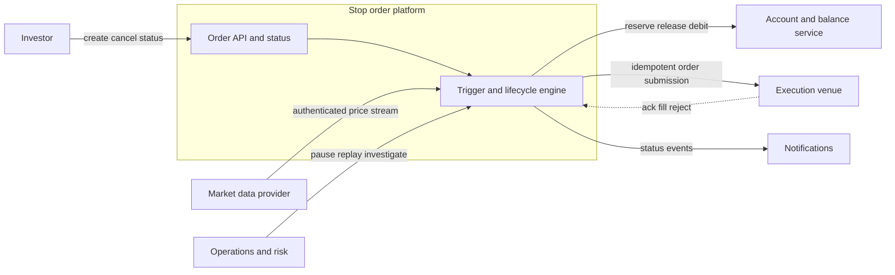
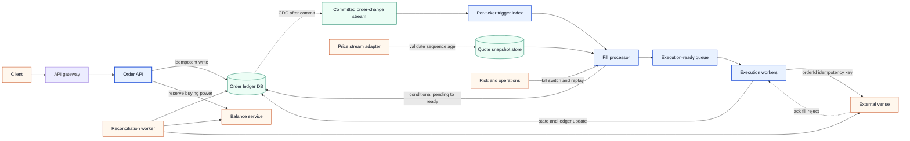
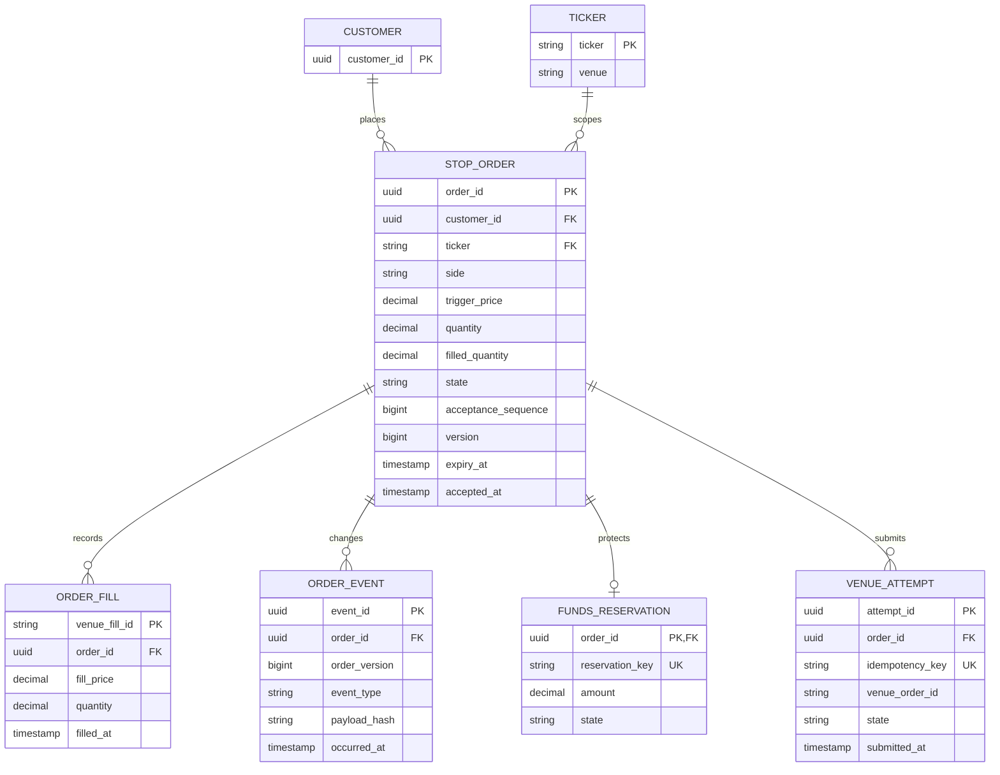
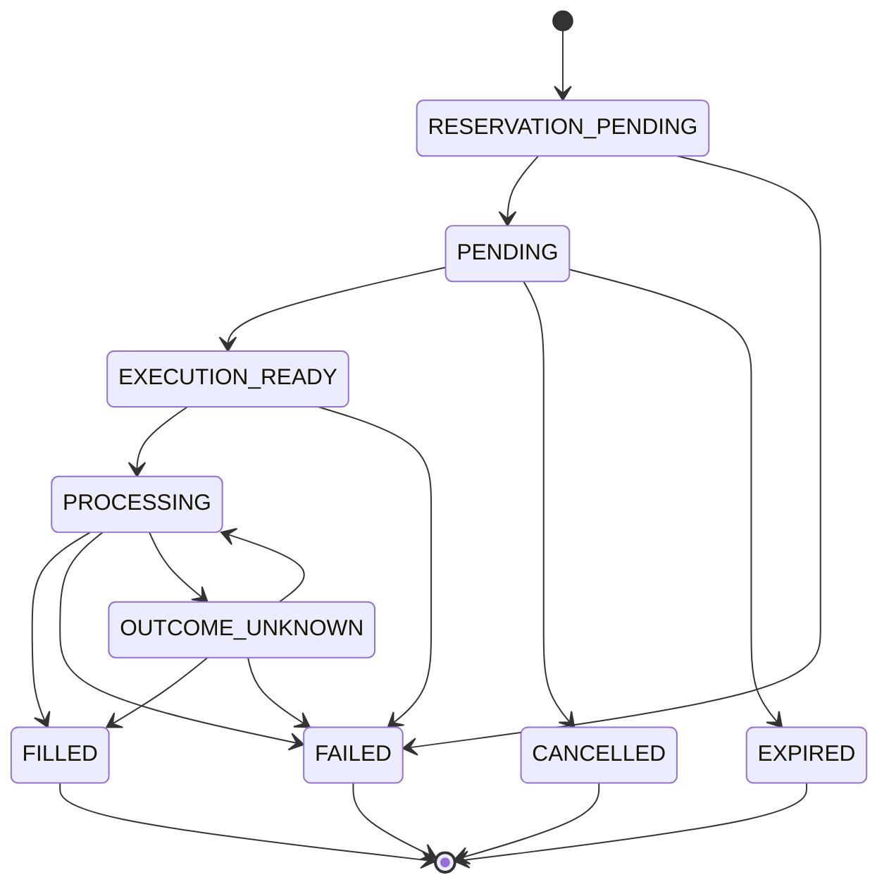

# Plum system design — stop-order execution flow

**Purpose:** a structured rehearsal for a trigger-driven order service: accept a user's buy or sell instruction, reserve the required funds, watch a price stream, and submit the order when its trigger is reached.

**Boundary:** this is a generic interview solution reconstructed from personal preparation notes. It is not Plum's internal design, an official interview prompt, or confidential material.

## 1. Prompt and contract

Design a backend service that executes a user's stock order when the market reaches a user-set trigger price. The service should support many orders for the same user and ticker, execute asynchronously through an external venue, and expose a trustworthy lifecycle to the user.

I would state these assumptions before drawing:

| Decision | Assumption for the first design | Why it matters |
| --- | --- | --- |
| Trigger semantics | A buy fires when `marketPrice <= triggerPrice`; a sell fires when `marketPrice >= triggerPrice`. | This is a boundary comparison, not a tolerance band. |
| Quantity | Whole-share quantity for the first version; partial fills are represented explicitly if the venue permits them. | It changes balance and terminal-state rules. |
| Deadline | An order can expire before it triggers. | Expiry races with a price tick and must be conditional. |
| Latency | Aim for about 10 ms from an accepted price event to an execution-ready transition and roughly 3 s end to end. The latter is an operational target, not a promise that an exchange will fill. | Separate our processing SLO from venue latency. |
| Fairness | Multiple orders for one ticker are ordered by a durable acceptance sequence. If product does not require FIFO, a deterministic sequence is still useful for replay. | Avoid inventing a global order across unrelated tickers. |
| Execution | The external venue is asynchronous and accepts an idempotency key. | A timeout cannot tell us whether the venue received the request. |

## 2. Four-quadrant discovery

### Q1 — actors, roles and business goals

- **Investor:** creates, cancels and observes an order; expects no duplicate debit or fill.
- **Order service:** validates the request, records the lifecycle and owns the customer-facing contract.
- **Price-feed adapter:** authenticates and normalises quotes from the market-data provider.
- **Account/balance service:** reserves and releases buying power; its ledger is the source of truth for money.
- **Execution adapter and venue:** receives an order, may acknowledge later, and emits fills or rejects.
- **Risk and operations:** can block a ticker, disable the feed, replay events and investigate breaks.

The business outcome is a predictable order experience: a valid trigger is noticed quickly, funds are protected, execution is not duplicated, and every uncertain outcome can be reconciled.

### Q2 — functional requirements

1. Create an order with a client idempotency key, ticker, side, quantity, trigger price and expiry.
2. Reserve funds before accepting a buy order. Reject atomically when available balance is insufficient.
3. Consume price events and identify crossed triggers without scanning every order.
4. Transition an eligible order to `EXECUTION_READY` exactly once from the customer's point of view.
5. Submit asynchronously to the venue; support acknowledgement, fill, reject, cancel and timeout outcomes.
6. Return current state and fill history. Support cancellation only before the order reaches a non-cancellable state.
7. Stop execution on stale or invalid market data and provide an operator kill switch.

### Q3 — reliability, availability and volume

State numbers as assumptions and ask the interviewer to change them:

- Customer API: 99.9% monthly availability; p99 under 500 ms for admission and status reads.
- Trigger path: p99 about 10 ms from an accepted tick to a durable claim, excluding the venue.
- End-to-end target: most triggered orders reach the venue within about 3 seconds; measure the tail separately.
- Workload: design for millions of open orders and bursty price updates. Partition by ticker so independent instruments scale horizontally.
- Correctness takes priority over stale execution: an old quote must never fire a new order.

### Q4 — business and risk metrics

Track both customer outcomes and safety signals:

- trigger-to-ready latency and trigger-to-venue latency at p50/p95/p99;
- price-feed age, sequence gaps, invalid-message count and paused-ticker count;
- orders admitted, triggered, filled, rejected, expired and cancelled;
- duplicate-claim rate, venue-timeout rate, reconciliation-break count and oldest unresolved break;
- reserved funds, failed reservations, fill notional by ticker and venue rejection reasons;
- consumer lag, cache-rebuild duration, queue depth and dead-letter volume.

## 3. Invariants that drive the architecture

These are the sentences I would keep visible while designing:

1. **An order cannot be filled twice.** Every transition out of a live state is conditional on the current state, and the venue receives `orderId` as its idempotency key.
2. **A buy cannot spend money twice.** `available + reserved = total` in the account ledger; a reservation and its release/final debit are ledger entries, not cache counters.
3. **Only a fresh, valid quote may trigger.** The feed adapter rejects bad signatures, old timestamps and sequence gaps; the ticker is paused until a safe snapshot is available.
4. **The database is authoritative.** The in-memory price index is a derived accelerator rebuilt from committed order changes and periodically reconciled.
5. **Every accepted order has one durable acceptance sequence.** It gives deterministic replay and, when required, FIFO within a ticker without promising global ordering across all instruments.

## 4. C1 — system context

The system boundary is the order and trigger platform. Account money, market data and execution are external contracts; they are not silently treated as local tables.



## 5. C2 — component architecture

There is one order lifecycle and one durable source of truth. The fill processor and execution workers are separate for throughput and failure isolation, but they communicate through durable events rather than trying to hold a request open.



### Request path

1. Authenticate, validate the instrument, side, price precision, quantity and expiry. Reject a reused idempotency key whose request fingerprint differs.
2. In one order-database transaction, insert the order in `PENDING` with a server acceptance sequence. A unique `(customer_id, client_idempotency_key)` constraint makes retries return the original order.
3. Reserve buying power through the account service. If the account contract cannot participate in the same database transaction, model the reservation as its own idempotent command and keep the order in `RESERVATION_PENDING` until it has a durable outcome.
4. Commit the order state and publish the committed change through CDC. The API returns the order identity and state; it does not wait for a price trigger or venue response.

### Price path

1. The adapter verifies authentication, timestamp and source sequence, persists the latest accepted snapshot, and records a feed watermark per ticker.
2. A ticker is assigned to one active fill-processor owner at a time. The owner loads its derived trigger index from a database snapshot plus CDC checkpoint and then applies new order changes in order.
3. For a buy at price `p`, retrieve trigger levels `>= p` because those orders allow buying at `p`. For a sell, retrieve levels `<= p` if the product defines the trigger as a minimum sell price. The exact comparison is a product rule, not an implementation detail.
4. For each candidate, execute a short conditional transaction:

   ```sql
   UPDATE orders
      SET state = 'EXECUTION_READY',
          triggered_price = :market_price,
          triggered_at = :observed_at,
          version = version + 1
    WHERE order_id = :order_id
      AND state = 'PENDING'
      AND expiry_at > :observed_at;
   ```

   Affected-row count `1` means this consumer won the claim. `0` means cancellation, expiry, another worker or a prior retry already won; it is not an error.
5. The claim emits an execution-ready event. The worker sends the venue request with `orderId` as the idempotency key and records `PROCESSING` before the call.

### Venue and settlement path

- A fast acknowledgement means “the venue accepted the request,” not “the trade filled.” Keep `PROCESSING` until a fill, reject or reconciled timeout is known.
- On a fill, record an immutable fill row, move the reserved amount to the final debit/position ledger, and transition the order to `FILLED` in one local transaction. Repeated fill events use the venue event ID as a unique key.
- On a reject or expiry, release the reservation exactly once and transition to `FAILED` or `EXPIRED`.
- On a timeout, query the venue by `orderId` before retrying. If the venue contract has no lookup, place the order in `OUTCOME_UNKNOWN` and let reconciliation resolve it; never issue an unkeyed retry.

## 6. Data model

The order ledger is the source of truth. The trigger index, queue offsets and analytics projections are derived state.



Useful indexes are `(ticker, state, trigger_price)`, `(customer_id, accepted_at)`, and `(state, expiry_at)`. Do not put the hot trigger index in the same table as the immutable event history; the index is rebuilt from order state and events.

## 7. Trigger index and scale

### Data structure

For each ticker owner, keep two ordered maps:

```java
NavigableMap<BigDecimal, ArrayDeque<OrderId>> buyByTrigger = new TreeMap<>();
NavigableMap<BigDecimal, ArrayDeque<OrderId>> sellByTrigger = new TreeMap<>();
```

The deque at a price level gives deterministic acceptance order. A buy tick at `p` examines `buyByTrigger.tailMap(p, true)`; a sell tick examines the opposite boundary defined by the product contract. Remove or mark candidates as they are claimed, but only the conditional database transition decides correctness.

### Refresh and recovery

- New orders enter the database first. CDC carries the committed order version to the ticker owner, which applies it idempotently.
- On restart, load a checkpointed snapshot and replay CDC from the checkpoint. If the checkpoint is too old, rebuild the ticker from `PENDING` rows and then resume from a new offset.
- A periodic reconciler compares index membership with live `PENDING` rows. It repairs missing entries and removes orders that are cancelled, expired or already claimed.
- Use a lease/fencing token so a paused owner cannot continue writing after a replacement owner takes over.

### One million price updates in three seconds

Do not scan all open orders for every tick. A lookup costs approximately `O(log P + K)`, where `P` is the number of price levels for the ticker and `K` is the number of candidates actually crossed. Scale by:

1. partitioning independent tickers across owners;
2. keeping the index local to the owner and the database writes short;
3. batching only local claim/status writes where the database can preserve per-order conditional semantics;
4. bounding venue concurrency from the venue's measured rate limit;
5. conflating intermediate quotes only when the trigger rule is monotonic, retaining the interval high/low watermark so a crossed boundary cannot be lost.

If one ticker itself is hot, a single owner remains the simplest correctness boundary. Add a second execution stage behind the owner rather than allowing many writers to mutate the same ordered map. If product requires strict FIFO, the owner assigns the sequence; if it requires fairness across a closed window, use an explicitly documented clearing rule instead of pretending that unordered parallel consumers are fair.

## 8. State machine and race handling



Important races are resolved with conditional transitions, not long transactions:

- **Tick versus cancellation:** only one `UPDATE ... WHERE state = 'PENDING'` can win.
- **Tick versus expiry:** compare the feed observation time with `expiry_at` inside the claim; a later expiry job sees zero affected rows if the order was already claimed.
- **CDC duplicate:** apply `(order_id, order_version)` once; an older version is ignored.
- **Worker crash:** the durable state and idempotency key survive a restart. A timeout goes through venue lookup/reconciliation.
- **Feed gap:** stop claiming for that ticker, obtain a fresh snapshot, replay the interval if the provider gives a sequence, and only then resume.

## 9. Failure handling and operations

| Failure | Safe response |
| --- | --- |
| Duplicate or out-of-order price | Deduplicate by provider sequence; ignore older values. Pause on an unfillable gap. |
| Feed silent or stale | Mark the ticker unsafe after the configured age, alert, and stop new claims. A kill switch can stop all tickers. |
| Index process dies | Fenced takeover, checkpoint plus CDC replay, then reconciliation against `PENDING` rows. |
| Account service timeout | Keep the reservation command pending with an idempotency key; query outcome before retrying. |
| Venue timeout | Query by order ID. If unknown, keep `OUTCOME_UNKNOWN` and reconcile; never submit a second unkeyed order. |
| Duplicate venue fill | Unique venue fill ID makes the second event a no-op. |
| Partial fill | Record each fill and keep remaining quantity; release only the unused reservation. |
| Poison event | Bounded retries, dead-letter with alert and an audited replay operation. |
| Database unavailable | Stop claims, keep the feed buffered within a bounded limit, and expose a degraded status rather than firing from memory alone. |

## 10. How I would present it in the interview

> “I would keep one durable order ledger and treat the price index as a derived cache. A buy fires when the market price is at or below its trigger, and a sell uses the opposite comparison. On admission I reserve funds and persist `PENDING` with a server sequence. The price adapter validates freshness and sequence, then a single owner per ticker looks up crossed levels in a `TreeMap`. It conditionally moves each order to `EXECUTION_READY`; the affected-row count is the ownership decision, so cancellation, expiry and duplicate delivery are safe. Execution is asynchronous and uses the order ID as the venue idempotency key. Fills update an immutable fill log and the account ledger. Stale-feed guards, a kill switch, bounded retries, venue lookup and reconciliation handle the failure cases. I would scale independent tickers horizontally, batch only local database work, and measure the 3-second target against actual venue capacity.”

The answer is complete when the interviewer can see:

- the exact trigger comparison;
- the single source of truth and the derived index boundary;
- the short conditional claim rather than a 15-minute transaction;
- how money reservation, venue uncertainty and duplicate fills are handled;
- a capacity argument that does not hide behind “put it on a queue.”

## 11. Follow-up questions to practise

1. What does the venue guarantee for idempotency and for querying an unknown submission?
2. Is strict FIFO required, or is deterministic per-ticker ordering sufficient?
3. Are partial fills allowed, and when is the unused reservation released?
4. How do you replay a price gap without firing on an old quote?
5. What is the business response when the 3-second target cannot be met because the venue is slow?
6. Which metrics page an operator before customers report a problem?
7. What changes if there are one million updates for one ticker rather than one million updates across many tickers?

