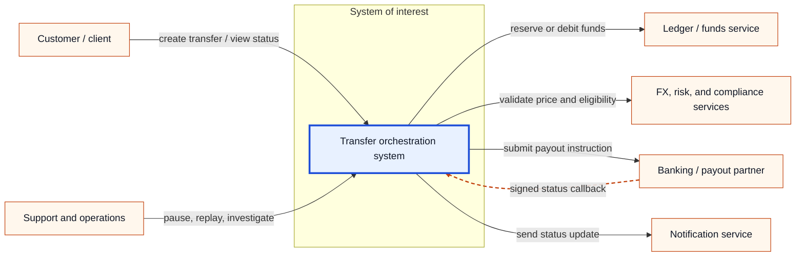
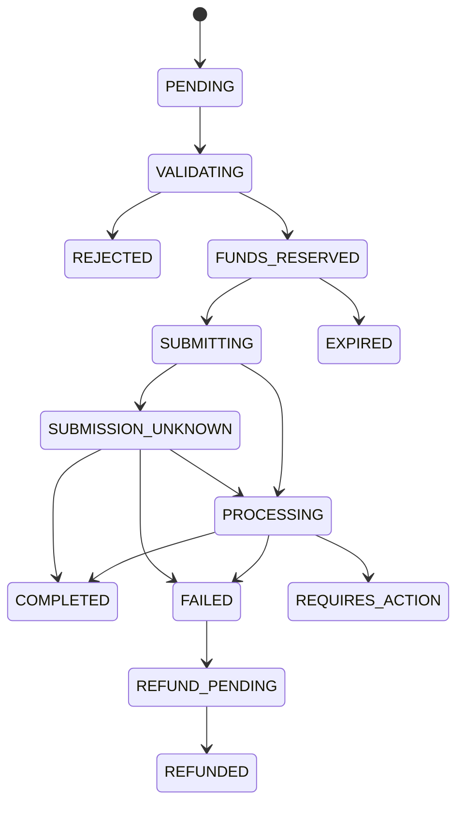
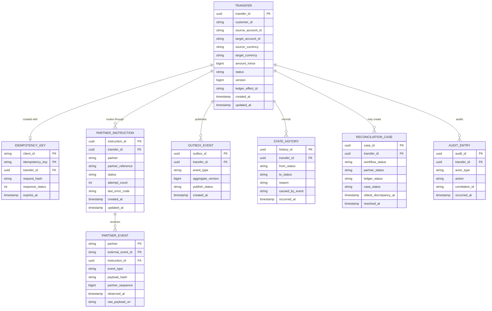
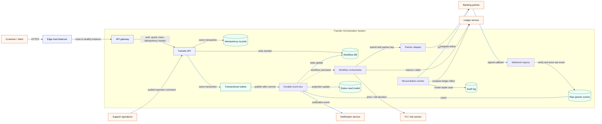

# Scalable transfer settlement

**Use:** a role-neutral system-design rehearsal for a scalable payment platform and one transfer's settlement lifecycle.

**Public-source boundary:** anonymous public reports describe broad payment-platform and distributed-system exercises. The design below is a generic practice scenario, not a claim about any company's private architecture or a recovered prompt.

## Public prompt signals

An anonymous [public candidate report](https://www.glassdoor.com/Location/Wise-Tallinn-Location-EI_IE637715.0%2C4_IL.5%2C12_IC2775919.htm) describes the broad task “build a scalable platform that can handle payments.” That is useful evidence for the problem family, not for exact wording or recurrence.

### Other public question signals

These are useful rehearsal variants, not predictions:

1. One Glassdoor report says only “distributed system.” This is too vague to recover a task, but it reinforces distributed-systems follow-ups.
2. Another report mentions **event-driven architecture and data buckets** without preserving the business statement. Practise event modelling, partitioning, replay, and aggregation rather than claiming a precise prompt.
3. A generic ride-sharing design appears in another report and may come from a different team or period.
4. A Reddit report describes a finite share offering where concurrent purchases must not oversell while an external service handles payment.
5. Another Reddit report describes a rolling 24-hour financial-volume feature and read/write contention.

The highest-confidence target remains the scalable payment platform. The share-offering and 24-hour-volume variants are especially good extensions because they exercise the same core skills: concurrency, idempotency, financial correctness, time-window aggregation, and read/write scaling.

Sources: [Wise distributed-system Glassdoor entry](https://www.glassdoor.com/Interview/Pair-Programming-and-gt-Concurrency-circuit-breaker-System-design-and-gt-distributed-system-QTN_8763393.htm), [Wise Glassdoor entry mentioning event-driven architecture and data buckets](https://www.glassdoor.com.br/Entrevista/Wise-Entrevista-RVW96353247.htm), [Wise Glassdoor entry mentioning Uber](https://www.glassdoor.ie/Interview/Coding-round-Somewhat-leetcode-medium-level-with-I-O-System-design-design-Uber-system-QTN_7633900.htm), [candidate report: Wise share offering](https://www.reddit.com/r/cscareerquestionsuk/comments/1u3bka8/wise_seniori3_pair_programming_round/), and [candidate report: Wise 24-hour volume feature](https://www.reddit.com/r/cscareerquestionsuk/comments/1lcwqki/wisetransferwise_product_interview_round/).

## Practice prompt — derived from public signals

The scenario below operationalises the public prompt family for rehearsal; it is not presented as an insider or leaked question.

> Design a scalable platform that can handle payments. For this rehearsal, narrow the scope to an international transfer: a customer creates a transfer from currency A to currency B; the system validates it, records the debit/credit legs, submits it to a banking partner, exposes status, handles retries and duplicate callbacks, and reconciles against the ledger.

The goal is not to design every subsystem. The goal is to show that one transfer has a correct, observable, recoverable lifecycle.

## 60-minute operating script

| Time | Activity | Output |
|---|---|---|
| 0–2 min | Restate the problem | Confirm the system boundary and what “complete” means |
| 2–7 min | Four-quadrant discovery | Actors/goals, functional requirements, NFRs, business metrics |
| 7–12 min | C1 system context | One system boundary and external dependencies |
| 12–20 min | Domain model and API | Transfer state machine, invariants, idempotency contract |
| 20–30 min | C2 container diagram | Components introduced only to satisfy named requirements |
| 30–45 min | Failure deep dives | Duplicates, retries, partner ambiguity, ledger outage, regional outage |
| 45–53 min | Scale and operations | Capacity, observability, security, testing, reconciliation |
| 53–60 min | Trade-offs and close | Summarise decisions and ask targeted questions |

Do not draw all components at minute one. The diagram should grow from requirements.

## Opening script

Say:

> “I’ll first clarify the actors, functional scope, quality attributes, and success measures. Then I’ll draw a system-context view, define the transfer lifecycle and invariants, and expand into containers. I’ll keep the ledger as the financial source of truth and treat partner callbacks as untrusted, retryable facts.”

## Four-quadrant discovery

This is an interview framing built from standard requirements engineering, DDD, quality attributes, product metrics, and C4 modelling. Do not call it a proprietary framework; simply say you want to clarify four areas.

### 1. Actors and domain boundaries

Ask:

1. Is the primary actor a retail customer using a mobile/web client?
2. Is the ledger an existing authoritative service that this system calls, or is it part of the design?
3. Are FX/risk checks and partner-bank connectivity existing services?
4. Should support/operations be able to pause, replay, or repair a transfer?
5. Are we designing one partner flow or a provider-agnostic platform?

Actors and external systems:

- Customer/client
- Transfer orchestration system (system under design)
- Ledger/funds service
- FX/risk/compliance services
- Banking or payout partners
- Notification service
- Support/operations and reconciliation operators

DDD clarification: actors are participants with goals. Domain objects and boundaries come next: `Transfer` is the workflow aggregate; `LedgerEntry` remains owned by the ledger; `PartnerInstruction` represents an external submission; `ReconciliationCase` represents an exception requiring investigation.

### 2. Functional requirements

Start with the minimum viable lifecycle:

- Create a transfer safely, including client retries.
- Validate destination, amount, currency, and eligibility.
- Reserve or debit funds through the ledger.
- Submit a partner instruction.
- Ingest partner status callbacks.
- Expose current status and a customer-facing history.
- Retry transient failures without creating a second financial effect.
- Reconcile workflow state, partner state, and ledger state.
- Allow an operator to pause, replay, or investigate an exception.

Ask which of cancellation, refunds, partial payout, scheduled transfers, and multi-partner routing must be in the first release. Do not silently design all of them.

### 3. Non-functional requirements

Propose targets, then ask the interviewer to adjust them:

- **Correctness:** duplicate successful financial effects must be zero.
- **Status freshness:** normal status updates visible within 30 seconds.
- **Availability:** define a target such as 99.95% for create/status APIs.
- **Durability:** every accepted command and partner callback is durably recorded.
- **Recovery:** state an RPO/RTO for a region or partner outage.
- **Auditability:** immutable state-transition and operator-action history.
- **Security:** authenticated clients, signed partner callbacks, least-privilege service access, and encrypted sensitive data.
- **Data residency:** route and store data according to country/regulatory constraints.

### 4. Business and operational metrics

Use metrics that describe customer and financial outcomes, not only infrastructure:

- transfer completion and return rates
- p50/p95 time from accepted to completed
- stuck-transfer count and age
- partner timeout/error rate and partner SLA
- reconciliation-gap count and oldest-gap age
- ledger reservation expiry rate
- notification delay
- support contacts per 1,000 transfers
- duplicate financial effects: **must remain zero**

Say:

> “I’ll optimise first for financial correctness and recoverability, then for completion latency. A fast transfer that can debit twice is not a successful system.”

## C4 level 1 — System Context diagram

C4 diagrams use **System Context** for C1 and **Container** for C2. A C4 container is a deployable application or data store; it does not necessarily mean a Docker container.



**Legend:** solid arrows are synchronous calls or commands; dashed arrows are asynchronous callbacks/events. The thick blue boundary is the system being designed. Orange nodes are outside the team’s ownership boundary.

### C1 spoken walkthrough

> “The customer calls the transfer system. We do not own the ledger; we ask it to reserve or debit funds and treat its response as authoritative for money. FX and risk are external decisions that can reject or hold a transfer. The partner is outside our control and can timeout, retry, reorder, or send contradictory callbacks. Support needs controlled pause/replay access. Notifications are downstream and must not determine whether the money moved.”

Then ask:

> “For the rest of the design, may I assume one transfer has one primary partner instruction, at-least-once events are acceptable, and the ledger is the source of truth?”

## Domain model and invariants

### Transfer state machine



Keep transitions monotonic for the customer-visible lifecycle. A callback may repeat `PROCESSING`; it must not move a terminal `COMPLETED` transfer back to `PENDING`.

### Invariants to say aloud

1. One client idempotency key maps to one request fingerprint and one transfer result.
2. A different payload with an existing idempotency key is rejected with `409 Conflict`.
3. Each financial effect has a unique ledger command or effect ID.
4. Every partner callback is stored before interpretation, so it can be replayed.
5. Unknown partner responses remain `SUBMISSION_UNKNOWN`; the system queries or reconciles before retrying.
6. The ledger, not the read model, decides the authoritative balance and debit state.
7. Operators can repair workflow state only through audited commands; they cannot silently edit balances.

## How to sound DDD-expert without performing jargon

DDD is useful here because it makes **ownership, invariants, and consistency boundaries** explicit. Do not sprinkle terms over a generic microservices diagram. Introduce each term because it answers a design question.

### Start with bounded contexts and ownership

Say:

> “I see several bounded contexts with different language and consistency needs: Transfer Orchestration owns the customer-facing workflow; Ledger owns balances and financial effects; FX/Risk owns pricing and eligibility decisions; Partner Settlement owns provider-specific submission and callback semantics; Notifications owns delivery, not transfer truth.”

The important point is not that each context must become a separate deployment. The point is that each has one vocabulary and one owner for its rules.

### Name the aggregate and its invariants

Use `Transfer` as the orchestration aggregate root. It owns the lifecycle and prevents invalid state transitions. It should not contain the entire ledger or every partner callback.

Say:

> “The `Transfer` aggregate protects workflow invariants—one active partner instruction, monotonic customer-visible state, and one correlation to the ledger effect. The ledger has its own aggregate and transaction boundary; I would not duplicate balance ownership inside `Transfer`.”

This demonstrates the most important DDD judgement: an aggregate is a **consistency boundary**, not a convenient object containing every related table.

### Separate entities from value objects

Useful value objects:

- `Money(amountMinor, currency)` — no floating-point arithmetic
- `TransferId`, `AccountId`, `PartnerInstructionId`, `IdempotencyKey`
- `TransferStatus` and `FailureReason`
- `RequestFingerprint`

Entities with identity and lifecycle:

- `Transfer`
- `PartnerInstruction`
- `ReconciliationCase`

Say:

> “Money and identifiers are value objects: equality is by value and they are immutable. A transfer and a reconciliation case have identity and history, so they are entities.”

### Use commands and events deliberately

Commands ask an owner to make a decision:

- `CreateTransfer`
- `ReserveFunds`
- `SubmitPartnerInstruction`
- `PauseTransfer`
- `StartReconciliation`

Events state that something already happened:

- `TransferCreated`
- `FundsReserved`
- `PartnerInstructionSubmitted`
- `PartnerStatusReceived`
- `TransferCompleted`
- `ReconciliationGapDetected`

Say:

> “The event says what happened; it does not tell another context to mutate an unrelated aggregate directly. Consumers translate the event into a command in their own model.”

### Show the anti-corruption layer

The partner adapter is a DDD anti-corruption layer. Partner APIs may say `PAID`, `SETTLED`, `RETURNED`, or `UNKNOWN`; the adapter translates those terms into the orchestration vocabulary without leaking provider-specific rules into the `Transfer` aggregate.

Say:

> “I would keep partner terminology behind the adapter. The orchestration context sees a canonical status and a partner reference; the adapter owns provider-specific retries, signatures, error codes, and idempotency rules.”

### Make consistency boundaries explicit

Use this sentence:

> “Inside the Transfer aggregate, state transition and idempotency checks are strongly consistent. Across Transfer, Ledger, Partner Settlement, and Notifications, I use durable events and reconciliation, so the integration is eventually consistent but financially safe.”

This is stronger than saying “we use eventual consistency” without saying where it is safe.

### Distinguish domain services from application orchestration

- **Application service/orchestrator:** coordinates the use case and calls other contexts.
- **Domain service:** owns a business rule that does not naturally belong to one entity, such as selecting an eligible partner from corridor, currency, risk, and capability rules.
- **Repository:** persists an aggregate; it should not become a generic data-access layer containing business decisions.

Say:

> “The orchestrator coordinates the workflow; a domain service can evaluate partner eligibility; the repository persists the Transfer aggregate. None of those names changes the ownership of the rules.”

### 60-second DDD summary

> “I would model Transfer Orchestration as a bounded context. Its aggregate root is Transfer, protecting idempotency and lifecycle invariants. Money, currency, and identifiers are immutable value objects. Ledger and Partner Settlement are separate bounded contexts with their own aggregates and consistency rules. We communicate through commands and integration events, and the partner adapter acts as an anti-corruption layer. That gives us strong consistency inside the workflow boundary and explicit, reconciled eventual consistency across financial integrations.”

### DDD traps to avoid

- Do not equate one microservice with one bounded context automatically.
- Do not put ledger balances, partner state, and notifications inside one giant `Transfer` aggregate.
- Do not call every asynchronous message an event; a command asks for action, an event records a fact.
- Do not make a shared database the integration contract between contexts.
- Do not use “eventual consistency” as an excuse to tolerate duplicate money movement.
- Do not lead with DDD terminology; lead with the business invariant, then name the modelling choice that protects it.

## Persistence model and entity relationships

The following is the **Transfer Orchestration workflow database**. The Ledger and banking partner databases remain external bounded contexts. We store their stable identifiers and observed facts, but we do not create foreign keys into systems we do not own.

### ER diagram



### How to explain the relationships

- **Transfer → IdempotencyKey:** one create command has one `(client_id, idempotency_key)` uniqueness constraint. A repeated request returns the existing transfer; a different request hash returns `409 Conflict`.
- **Transfer → PartnerInstruction:** a transfer may have an initial instruction and, depending on the corridor, a controlled replacement or return instruction. Each instruction has a stable internal ID and partner reference. A retry reuses the same partner idempotency key rather than inserting an uncontrolled second instruction.
- **PartnerInstruction → PartnerEvent:** callbacks are keyed by `(partner, external_event_id)`. The unique key makes duplicate delivery harmless. Raw payloads are immutable and can be replayed.
- **Transfer → OutboxEvent:** transfer state and the outbox event are written in the same database transaction. The relay can retry publication without losing the workflow event.
- **Transfer → StateHistory:** current status is optimised for reads; history provides an immutable audit trail for support, debugging, and reconciliation.
- **Transfer → ReconciliationCase:** a discrepancy is a first-class exception, not a hidden status mutation. One transfer may create multiple cases over time, but only one open case should exist for a given discrepancy key.
- **Transfer → AuditEntry:** operator pauses, replays, releases, and repairs are separately attributable and auditable.

### Important columns and constraints

```sql
CREATE TABLE transfer (
    transfer_id         UUID PRIMARY KEY,
    customer_id         TEXT NOT NULL,
    source_account_id   TEXT NOT NULL,
    target_account_id   TEXT NOT NULL,
    source_currency     CHAR(3) NOT NULL,
    target_currency     CHAR(3) NOT NULL,
    amount_minor        BIGINT NOT NULL CHECK (amount_minor > 0),
    status              TEXT NOT NULL,
    version             BIGINT NOT NULL DEFAULT 0,
    ledger_effect_id    TEXT UNIQUE,
    created_at          TIMESTAMPTZ NOT NULL,
    updated_at          TIMESTAMPTZ NOT NULL
);

CREATE TABLE idempotency_key (
    client_id           TEXT NOT NULL,
    idempotency_key     TEXT NOT NULL,
    transfer_id         UUID NOT NULL REFERENCES transfer(transfer_id),
    request_hash        TEXT NOT NULL,
    response_status     INT NOT NULL,
    expires_at          TIMESTAMPTZ NOT NULL,
    PRIMARY KEY (client_id, idempotency_key)
);

CREATE UNIQUE INDEX one_open_reconciliation_case
    ON reconciliation_case (transfer_id)
    WHERE case_status = 'OPEN';
```

Do not present this as production-ready SQL in the interview. Use it to explain the invariants:

- `version` enables optimistic concurrency control: `UPDATE ... WHERE transfer_id = ? AND version = ?`.
- `ledger_effect_id` prevents the workflow from recording two successful effects for one transfer.
- The idempotency primary key protects the API boundary.
- The partner event primary key protects the callback boundary.
- `amount_minor` plus ISO currency avoids floating-point money errors.
- State history and audit entries are append-only; current state is a projection for efficient reads.

### Transaction boundaries

**One local database transaction:**

1. Insert or verify the idempotency key.
2. Insert the `TRANSFER` aggregate.
3. Insert the initial `STATE_HISTORY` row.
4. Insert `OUTBOX_EVENT(TransferCreated)`.
5. Commit.

**Not one distributed transaction:**

- The ledger reserve/debit is a separate command with a unique effect ID.
- Partner submission is a separate command with a partner idempotency key.
- The event bus and notifications are asynchronous.
- Reconciliation resolves ambiguous cross-system outcomes.

Say:

> “I keep the local aggregate and outbox atomic. I do not pretend to have a transaction spanning our database, the ledger, and a banking partner. Those boundaries are coordinated with idempotent commands, durable events, and reconciliation.”

### Indexes and retention

- `transfer(customer_id, created_at DESC)` for customer history.
- `transfer(status, updated_at)` for stuck-transfer scans.
- `partner_instruction(partner, partner_reference)` for callback correlation.
- `partner_event(partner, external_event_id)` as the deduplication key.
- `outbox_event(publish_status, created_at)` for relay polling.
- `reconciliation_case(case_status, oldest_discrepancy_at)` for operations.
- Partition large history/raw-event tables by time and region where required; keep the hot workflow row small.
- Retain audit/raw events according to regulatory, privacy, and data-residency requirements rather than indefinitely in the primary workflow database.

## API contract

### Create transfer

```http
POST /v1/transfers
Idempotency-Key: 8a2c...
Content-Type: application/json

{
  "sourceAccountId": "acct_123",
  "sourceCurrency": "GBP",
  "targetAccountId": "acct_456",
  "targetCurrency": "EUR",
  "amountMinor": 10000,
  "clientReference": "invoice-42"
}
```

Response for an accepted command:

```http
202 Accepted

{
  "transferId": "tr_789",
  "status": "PENDING",
  "statusUrl": "/v1/transfers/tr_789"
}
```

The response is intentionally `202`: accepting the command is not the same as completing the partner payout.

### Read status

```http
GET /v1/transfers/{transferId}
```

Return customer-safe status, timestamps, failure category, and next action. Do not expose partner credentials, internal retry counts, or sensitive risk reasons.

### Partner callback

```http
POST /v1/partners/{partner}/events
X-Signature: ...
X-Partner-Event-Id: evt_123
```

The endpoint authenticates and durably stores the raw event before acknowledging it. Duplicate event IDs return success without applying the event twice.

## C4 level 2 — Container diagram



### Practical explanation of each container

**Edge load balancer**

Routes HTTPS traffic to healthy gateway instances and removes unhealthy instances. It improves distribution and availability; it does not validate transfer business rules or own idempotency.

**API gateway**

Authenticates the client, applies coarse quotas, terminates or forwards TLS according to the security model, propagates correlation IDs, and passes through the idempotency key. It should not decide whether a transfer is financially valid.

**Transfer API**

Validates the command, checks the idempotency record, creates the transfer workflow record, and returns a stable transfer ID. It should remain fast and avoid waiting synchronously for a banking partner.

**Workflow DB**

Stores the current workflow state, request fingerprint, version, timestamps, partner instruction ID, and retry-safe metadata. It is the source of truth for orchestration state, not for money.

**Idempotency records**

Store `(client, idempotency_key, request_hash, response)` with a uniqueness constraint. A retry returns the original result; a changed payload is rejected.

**Transactional outbox**

Writes a publishable event in the same database transaction as the transfer state. A relay publishes it later. This prevents “database committed but event lost.”

**Durable event bus**

Buffers asynchronous work, supports consumer retries and replay, and separates workflow progress from the customer request. Consumers must be idempotent because delivery is at least once.

**Workflow orchestrator**

Owns the state machine and coordinates ledger, risk, and partner steps. It uses timeouts and explicit states rather than assuming a network response tells the whole truth.

**Partner adapter**

Normalises partner-specific APIs, error codes, rate limits, callback formats, and idempotency behaviour behind one internal interface.

**Webhook ingress and raw-event store**

Authenticates the signature, validates schema, records the immutable raw event and partner event ID, then acknowledges quickly. Processing can be retried from the stored event.

**Status read model**

Serves customer reads without putting the workflow database under all query load. It is eventually consistent; the API exposes `updatedAt` and does not claim completion before the authoritative workflow/ledger state supports it.

**Reconciliation worker**

Periodically compares partner status, workflow state, and ledger effects. It creates a repair case or a safe retry command; it does not guess which money movement occurred.

## End-to-end happy path script

Say:

> “A customer submits a transfer with an idempotency key. The gateway authenticates and rate-limits the request, but the Transfer API owns validation. We atomically store the request fingerprint, a `PENDING` transfer, and an outbox event. The API returns a transfer ID and does not wait for the partner.”

> “The orchestrator consumes the event, asks the ledger to reserve funds using a unique effect ID, and persists the reservation reference. It then asks the partner adapter to submit the payout with a partner idempotency key. Partner progress is represented as events, and the customer status is projected asynchronously.”

> “A successful partner confirmation moves the workflow to `COMPLETED` only after the corresponding ledger effect is confirmed. Notifications are emitted from the resulting state change, so a notification failure cannot make a transfer look completed or cause another debit.”

## Failure-handling script

### Client retries `POST /transfers`

> “The idempotency key is unique per client and request. If the same request arrives again, I return the original transfer ID and status. If the same key has a different request hash, I return `409 Conflict`. This protects the API boundary, but I also need a distinct effect ID at the ledger and partner boundaries.”

### Event bus redelivery

> “Consumers acknowledge only after the state transition is committed. A redelivered event is harmless because the consumer stores the last applied event/version and uses a conditional update. We do not need exactly-once transport; we need idempotent effects.”

### Partner timeout after submission

> “A timeout does not mean the partner rejected the transfer. The state becomes `SUBMISSION_UNKNOWN`. I query the partner by our partner reference or let reconciliation discover the result. I do not blindly submit again, because that could create a duplicate payout.”

### Duplicate or out-of-order callback

> “I store the partner event ID and reject duplicate application. For ordering, I use a partner sequence/version when available; otherwise I apply a transition matrix and preserve every raw event. A terminal state cannot be overwritten by an older event.”

### Ledger unavailable

> “The workflow remains `PENDING` or `FUNDS_RESERVATION_RETRY`, with bounded backoff and a visible status. The request is not accepted as financially complete. After the retry budget, it goes to an operator-visible exception queue.”

### Reserved funds but partner unavailable

> “The reservation has a correlation ID and expiry policy. We retry the partner safely, then either release the reservation through an explicit ledger command or escalate for reconciliation. We never infer that a missing partner response means the funds can be released.”

### Region failure

> “For a first version I would choose a single writer or home region per transfer and replicate durable workflow and raw events. On failover, health-based routing sends new traffic to the promoted region only after fencing the old writer. We replay idempotently, reconcile ledger and partner state, and state an RPO/RTO rather than claiming multi-region replication alone solves availability.”

## Scale and capacity script

Ask for numbers first. If none are provided, say:

> “For a sizing exercise only, I’ll assume 5 million transfers per day, a 10× peak multiplier, ten status reads per transfer, and 30-day hot workflow retention.”

Then calculate:

- 5M/day ≈ 58 transfer writes/second average.
- 10× peak ≈ 580 writes/second.
- Ten reads per transfer ≈ 580 reads/second average and about 5.8k reads/second at peak.
- Add headroom for retries, reconciliation, and partner callbacks rather than sizing only the happy path.
- Store immutable raw callbacks and audit events separately from the hot workflow tables; archive according to retention and residency rules.

Say:

> “The exact numbers are less important than identifying the dominant dimension. Here, read traffic, partner retries, and reconciliation bursts may dominate the create-request rate.”

## Observability, security, and testing

### Observability

- Correlation ID from client request through ledger effect and partner reference.
- Metrics for state-transition latency, stuck age, partner errors, retry counts, reconciliation gaps, and stale projections.
- Traces across gateway, workflow, ledger, and partner adapter.
- Structured logs with transfer ID, tenant/account scope, version, and deployment version—never raw secrets.
- Alerts on missing event flow and silent logging/telemetry failure.
- Dashboards tied to customer and financial invariants, not only CPU and latency.

### Security and privacy

- Authenticate clients and authorise account ownership at the command boundary.
- Verify partner webhook signatures and defend against replayed callbacks.
- Encrypt sensitive data, minimise stored personal data, and apply region-specific storage/routing.
- Separate support privileges for viewing, pausing, replaying, and repairing.
- Audit every operator action and every financial effect ID.

### Tests and operational validation

- Unit tests for state-transition rules and idempotency conflicts.
- Contract tests for ledger and each partner adapter.
- Integration tests for outbox relay, event redelivery, and callback authentication.
- Property tests: no duplicate effect for any retry sequence; terminal state never regresses.
- Fault injection: broker unavailable, ledger timeout, partner timeout, duplicate callback, delayed callback, corrupted event, and region loss.
- Replay and reconciliation drills using production-shaped but non-sensitive data.
- Canary releases, schema backward compatibility, migration rollback, and explicit RPO/RTO exercises.

## Trade-offs to discuss

### Synchronous versus asynchronous partner submission

- Synchronous submission gives a quick response but couples customer latency to partner availability.
- Asynchronous orchestration returns `202`, absorbs partner slowness, and makes recovery explicit.
- Choose asynchronous for the primary workflow; offer a read-after-write status check for customer experience.

### One workflow database versus event-sourced state

- A conventional workflow table plus immutable event/audit records is simpler to operate and query.
- Full event sourcing improves replay and history but increases modelling and operational complexity.
- Start with durable state transitions plus raw-event retention; evolve only if replay or audit requirements justify it.

### Active-active versus home-region single writer

- Active-active can reduce failover time but makes ordering, conflicts, and ledger ownership much harder.
- A home-region single writer is easier to reason about; controlled failover with fencing and replay is safer for financial effects.
- Choose the simpler model until RPO/RTO or residency requirements demand more.

## Interviewer follow-up answers

**“Why not just retry the partner call?”**

> “Because a timeout is ambiguous. The partner may have accepted the instruction. I query by a stable partner reference or let reconciliation resolve it before submitting again.”

**“Why is the read model not the source of truth?”**

> “It is an eventually consistent projection optimised for customer reads. The ledger owns financial truth; the workflow owns process state.”

**“How do you guarantee exactly-once?”**

> “I would not promise exactly-once delivery. I guarantee idempotent financial effects through unique effect IDs, conditional state transitions, and reconciliation under at-least-once delivery.”

**“What does self-healing mean here?”**

> “Automated bounded retry, circuit breaking, replay, and failover with guardrails. It does not mean automatically guessing a financial correction.”

**“What would you simplify for an MVP?”**

> “One region, one partner adapter, asynchronous workflow, a conventional workflow database, an outbox, signed callbacks, and a manual reconciliation queue. I would not start with active-active multi-region or a general rules engine.”

## Closing script

> “The design separates customer commands, financial truth, workflow state, partner integration, and read projections. Its central invariant is one financial effect per transfer despite retries and ambiguous responses. The main operational controls are idempotency, durable events, reconciliation, observability, and tested regional recovery. If we had another hour, I would deep-dive into the ledger reservation contract or the partner failure and reconciliation model.”

## Final checklist

- [ ] Clarified actors, scope, NFRs, and business metrics before drawing.
- [ ] Drew C1 with one system boundary and labelled solid versus asynchronous flows.
- [ ] Defined a state machine and invariants before naming infrastructure.
- [ ] Explained why every C2 container exists.
- [ ] Used `202 Accepted` for asynchronous completion.
- [ ] Covered client retries, duplicate events, out-of-order callbacks, ambiguous timeouts, ledger failure, and region failure.
- [ ] Stated RPO/RTO, freshness, peak traffic, and reconciliation metrics.
- [ ] Distinguished ledger truth from workflow state and read projections.
- [ ] Avoided claiming exactly-once transport or silently repairing money.
- [ ] Closed with trade-offs and a targeted deep-dive offer.

## Sources and context

- Official public guidance: [backend system-design preparation](https://wise.jobs/backend-system-design-interviews) and [backend pair-programming preparation](https://wise.jobs/backend-pair-programming-interviews).
- Public anecdotal signals: [Wise Glassdoor interview page](https://www.glassdoor.co.uk/Interview/Wise-Interview-Questions-E637715.htm), [Wise London interview report](https://www.glassdoor.co.uk/Location/Wise-London-Location-EI_IE637715.0%2C4_IL.5%2C11_IC2671300.htm), and [Wise system-design entry](https://www.glassdoor.co.uk/Interview/System-design-QTN_3446400.htm).
